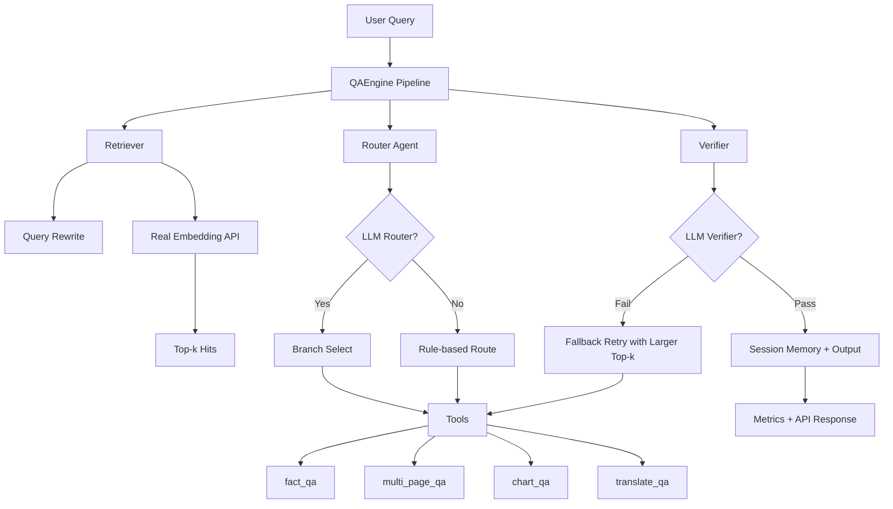

# 视觉 RAG Agent（Offer 冲刺版）

> 项目唯一核心目标：帮助你通过上海 45 万级 AI Agent 工程师面试。

## 唯一核心命令（写死）

```bash
./run_offer.sh
```

这条命令会自动完成：
- 创建/激活虚拟环境
- 安装依赖
- 加载 `.env`
- 启动 FastAPI 服务（`http://127.0.0.1:8000/docs`）

这个版本在原 demo 基础上升级为“简历技术点可落地”架构：

1. 检索层支持真实 embedding API（默认 OpenAI，失败自动 fallback）
2. Router 支持 LLM 决策 + 规则兜底
3. 翻译分支支持真实 LLM 翻译 + 多引擎 mock 回退
4. Verifier 支持 LLM 可证性判断 + 关键词规则回退
5. 所有能力可通过环境变量独立开关，便于灰度发布

---

## 简历技术点映射（代码证据）

| 简历技术点 | 对应代码 |
| --- | --- |
| ReAct 思路 Plan-Execute Loop | `src/engine/agent_loop.py`, `src/interfaces/api.py` (`loop_steps`) |
| 页面检索 + query rewrite + 预过滤 | `src/engine/retriever.py` |
| Router Function Calling/规则兜底 | `src/engine/router.py` |
| 多工具编排（4主工具+翻译） | `src/engine/tools.py` |
| Verifier 可证性校验 + fallback | `src/engine/verifier.py`, `src/engine/pipeline.py` |
| Session Memory | `src/engine/memory.py`, `src/infra/redis_memory.py` |
| Milvus 向量库适配 | `src/infra/vector_store.py` (`MilvusVectorStore`) |
| PyMuPDF 建库入口 | `src/infra/pdf_ingest.py` |
| FastAPI 服务化 + 监控 | `src/interfaces/api.py` (`/ask`, `/health`, `/metrics`) |
| 离线评测 Recall@10/Accuracy | `src/engine/eval_metrics.py`, `main.py` |

---

## 架构图



---

## 目录结构

- `offer_agent/`：正式包名（面试/演示统一入口）
  - `offer_agent/api.py`：API 入口（推荐使用 `uvicorn offer_agent.api:app`）
  - `offer_agent/__main__.py`：命令行入口（`python -m offer_agent`）
- `src/core/`：核心基础层（配置与数据模型）
  - `core/config.py`
  - `core/models.py`
- `src/engine/`：引擎流程层（检索、路由、工具、校验、评测、loop）
  - `engine/retriever.py`
  - `engine/router.py`
  - `engine/tools.py`
  - `engine/verifier.py`
  - `engine/pipeline.py`
  - `engine/agent_loop.py`
  - `engine/memory.py`
  - `engine/bootstrap.py`
  - `engine/eval_metrics.py`
- `src/interfaces/`：接口层（HTTP API）
  - `interfaces/api.py`
- `src/infra/`：基础设施适配层
  - `infra/vector_store.py`（InMemory/Milvus）
  - `infra/redis_memory.py`（Redis）
  - `infra/pdf_ingest.py`（PyMuPDF）
- `src/offer_agent_core/`：统一导出包（面试演示友好）
- `data/demo_pages.json`：演示数据（可替换为真实入库数据）
- `run_offer.sh`：一键启动命令（面试现场直接用）

---

## 快速开始

```bash
# 在仓库根目录执行
./run_offer.sh
```

---

## 启动 API（面试演示推荐）

```bash
# 在仓库根目录执行
source .venv/bin/activate
set -a
source .env
set +a
uvicorn offer_agent.api:app --host 0.0.0.0 --port 8000 --reload
```

接口说明：

- `GET /health`：健康检查
- `POST /ask`：问答主接口，请求体示例：`{"query":"采购申请单的采购单号是多少？","topk":3}`
- 返回中的 `loop_steps` 展示 Plan-Execute-Verify-Retry 每一步轨迹（可用于面试解释 ReAct 思路）
- `GET /metrics`：Prometheus 指标

---

## 生产模式配置

可选环境变量（仅列核心）：

```bash
export OPENAI_API_KEY="你的key"
export OPENAI_CHAT_MODEL="gpt-4.1-mini"
export OPENAI_EMBEDDING_MODEL="text-embedding-3-small"

export RAG_ENABLE_REAL_EMBEDDING=true
export RAG_ENABLE_LLM_ROUTER=true
export RAG_ENABLE_LLM_VERIFIER=true
export RAG_ENABLE_LLM_TRANSLATION=true
```

说明：

- 未配置 `OPENAI_API_KEY` 时，系统自动降级到规则/mock 路径，不会中断。
- 你可以逐步打开能力开关做灰度验证，先跑稳定性再拉全量。

---

## 下一步真实化建议

1. 把 `data/demo_pages.json` 替换为真实 PDF/PPT 渲染后页面元数据
2. 将 `PageRetriever` 的内存索引替换为 Milvus/Qdrant 向量库
3. 把 `SessionMemory` 落地到 Redis，并增加 TTL + 命中率监控
4. 在 `Verifier` 增加失败原因标签，打通线上观测面板
