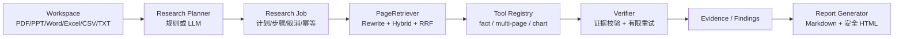

<div align="center">

# AI-Agent-RAG-Question-Answering

**企业多模态研究 Agent — 资料空间、深度研究、图表分析与可追溯报告**

*NotebookLM-style workspace + Deep Research orchestration + page-level multimodal RAG.*

[](https://www.python.org/)
[](https://fastapi.tiangolo.com/)
[](https://platform.openai.com/docs/api-reference)

</div>

---

## 项目简介

本项目是面向企业内部资料的 **多模态研究 Agent**，产品形态接近 NotebookLM + Deep Research。它不是只返回一段文字的文档聊天机器人：用户可以创建资料空间，导入 PDF、PPT、Word、Excel、CSV、TXT，执行跨文档研究计划，核对文字、表格与图表证据，最后生成带文档名和页码/page_id 的 Markdown/HTML 报告。

即时问答与复杂研究共用同一条 RAG 真源：Query Rewrite → 混合召回/RRF → 工具路由 → `fact_qa` / `multi_page_qa` / `chart_qa` → Verifier → 有限重试 → Evidence。无 GPU、无 Redis、无 Milvus、无付费模型 API 时，仍能使用内置示例数据和规则 fallback 跑通完整闭环。

系统面向 **万人员工规模、十万级企业文档库** 的知识检索与研究场景设计：轻量模式可在开发机直接运行，生产部署可按需接入 Redis、Milvus、ColPali、vLLM、Prometheus 和 GPU 推理服务，并对 API、检索与任务 Worker 分别扩容。

| 项 | 说明 |
|----|------|
| **应用入口** | `uvicorn offer_agent.api:app`（`offer_agent/api.py` → `src.interfaces.api:app`） |
| **主文档** | 本 README；**功能总览**见 [`docs/产品功能总览.md`](docs/产品功能总览.md)；**测试验收**见 [`docs/testing-validation-guide.md`](docs/testing-validation-guide.md)；开关见 **`.env.example`** |
| **隐私资料** | 简历、面试笔记、宣讲 PDF 等请放 **`private/`**（默认不入库，见 `private/README.md`） |

---

## 架构概览



**单轮路径**：`src/pipeline.py` 内「先路由 → 再按分支 top-k 检索 → 工具 → 校验 → 可选扩召回 / 换分支重试」。  
**多轮路径**：校验未通过且开启 `RAG_ENABLE_PLAN_EXECUTE_LOOP` 时，由 `PlanExecuteAgentLoop` 多轮扩 top-k 检索。

---

## 能力一览

| 模块 | 能力说明 |
|------|----------|
| **检索** | 文档聚合粗排 → 页级候选池、Agentic query expansion、BM25 + 向量 + RRF；当前可用千问 API 视觉重排，将来可无缝切换 ColPali |
| **路由** | 三分支：`fact` / `multi` / `chart`；规则优先，可选 LLM / Function Calling |
| **工具链** | `fact_qa` / `multi_page_qa` / `chart_qa`；粗召回与视觉重排后将少量页图交给 VLM，并绑定真实文件名、页码和 page_id |
| **校验** | 规则可证性 + 可选 LLM / VLM 校验；失败可扩 top-k 或分支 fallback 重试 |
| **编排** | 默认 `QAEngine` 主链路；已接入 `LangGraphQAEngine`（`RAG_ENABLE_LANGGRAPH=true` 可切换）；内置 Agentic critique → refine-query → retry；可选 `PlanExecuteAgentLoop`（多轮 retrieve–verify） |
| **可观测** | `/ask` 返回 `trace`；`/ask/stream` 以 SSE 实时推送路由、检索、生成、校验与重试事件；`/metrics` 暴露 Router / Verifier / 缓存等指标 |
| **评测** | `POST /eval/run` 离线跑样本集；`GET /eval/last` 读最近报告；报告落盘 `reports/eval/`（已 gitignore） |
| **服务化** | FastAPI：`/ask`、`/ask/stream`、`/health`、`/capabilities`、`/metrics`；静态托管 `web/chat.html` |
| **建库** | `build_index_incremental.py` 增量扫描 `user_docs/`，输出 `data/user_pages.json` 与页图目录 |
| **研究工作台** | Workspace 资料隔离、ResearchJob 计划/进度/取消、Evidence、Markdown/HTML 报告；SQLite 默认真源 |
| **执行过程** | 即时问答与 ResearchJob 均通过 SSE 推送可审计的阶段事件，前端实时展示；不暴露模型私有 chain-of-thought |
| **匿名会话** | 自动生成匿名客户端 ID，SQLite 持久化多对话与历史消息；无需注册即可新建、切换和删除对话 |
| **安全边界** | 上传白名单/大小限制/路径隔离、文档提示词注入防护、HTML 转义+CSP、资料目录默认不进入 Git/Docker context |
| **可靠性** | 原子幂等提交、取消竞态保护、任务/工具超时、有界 dispatcher、workspace 引擎缓存失效、重启中断状态修复 |

### 企业级规模设计

- **组织规模**：面向万人员工企业内部知识库，Workspace 提供长期资料边界与检索隔离。
- **资料规模**：面向十万级 PDF、PPT、Word、Excel 等企业文档，通过增量建库、Milvus 向量检索、文档类型预过滤和 ColPali 重排控制检索成本。
- **并发扩展**：API、索引、研究 Worker 和模型 Serving 相互解耦，可通过多副本 API、Redis、持久任务队列与独立推理服务水平扩容。
- **任务可靠性**：任务状态持久化、原子幂等、取消保护、超时、有界队列、失败 trace 和报告归档形成完整研究任务生命周期。
- **工程治理**：Prometheus 指标、离线评测、熔断降级、灰度发布、故障回放和 Docker/GPU 部署覆盖上线与持续迭代链路。

具体容量由文档结构、模型规格、检索后端、GPU 吞吐和部署副本数共同决定，仓库提供压测与评测入口用于生成对应环境的容量基线。

### API 过渡与自部署切换

`--qwen` 当前采用“较大候选集粗召回 → 千问 VL API 视觉重排 → top-k 页图生成 → flash 校验”。Embedding、Milvus、ColPali 和 VLM Gateway 仍使用稳定适配接口；GPU 服务器就绪后只需配置 `RAG_MULTIMODAL_EMBEDDING_API`、`RAG_COLPALI_RERANK_API`、`RAG_VLM_API` 并打开对应开关，无需改写 Agent 业务链路。

---

## 仓库目录结构

```text
.
├── README.md                      # 对外说明（主文档）
├── .env.example                   # 环境变量与 RAG_* 开关
├── main.py                        # 离线运行与评测入口
├── offer_agent/                   # Uvicorn 包入口（api:app）
├── src/                           # 核心业务
│   ├── pipeline.py                # 主链路编排
│   ├── router.py                  # 三分支路由
│   ├── retriever.py               # 混合检索
│   ├── tools.py                   # fact / multi / chart 工具
│   ├── api.py                     # HTTP 与 Prometheus
│   ├── eval_suite.py              # 离线评测
│   └── infra/                     # Redis 会话、评测报告存储等
├── scripts/
│   ├── one_click_demo.sh          # 一键安装依赖并启动 API（推荐）
│   ├── build_index_incremental.py # 增量建库
│   └── stage3_test_gate.py        # 提测门禁（health / ask+trace / eval）
├── web/chat.html                  # 聊天前端（trace + 提测面板）
├── data/demo_pages.json           # 内置示例索引（随仓库）
├── private/                       # 本地隐私区（仅 README 可入库）
├── deploy/
│   ├── docker/                    # Dockerfile 与 ColPali 镜像构建文件
│   └── compose/                   # 本地、GPU、监控、灰度等 compose 编排
├── requirements/                  # ColPali 等专项依赖
└── requirements.txt               # API 基础 Python 依赖
```

> `user_docs/`、`kb_pages/`、`data/user_pages.json`、`reports/eval/` 等由 **`.gitignore`** 排除，请勿将敏感语料提交远程。

---

## 快速开始

> 以下命令均在 **仓库根目录** 执行。

### 1. 获取代码

```bash
git clone https://github.com/NickWilde-AI/AI-Agent-RAG-Question-Answering.git
cd AI-Agent-RAG-Question-Answering
```

### 2. 环境变量

```bash
cp .env.example .env
```

默认离线模式不要求模型 Key。需要模型规划、生成或真实 embedding 时，再配置 **OpenAI-compatible** 接口：

| 变量 | 说明 |
|------|------|
| `OPENAI_API_KEY` | API 密钥 |
| `OPENAI_BASE_URL` | 网关地址，如 `https://api.openai.com/v1` 或兼容中转 |
| `OPENAI_CHAT_MODEL` | 对话模型名 |

其余 `RAG_*` 开关见 `.env.example` 注释；默认多为轻量关闭，可按需开启。

### 3. 启动

**一键启动（推荐首次）** — 安装依赖、可选增量建库、后台启动 API：

```bash
bash scripts/one_click_demo.sh
```

默认是**纯本地离线模式**，不会把资料发送到远端模型 API。常用控制命令：

```bash
bash scripts/one_click_demo.sh --api       # 使用 .env 中的 OpenAI-compatible API
bash scripts/one_click_demo.sh --qwen      # 千问解析 + API 视觉重排 + 页图生成/校验
bash scripts/one_click_demo.sh --full      # API + Redis + ColPali（需 Docker/GPU）
bash scripts/one_click_demo.sh --status    # 查看状态
bash scripts/one_click_demo.sh --stop      # 停止脚本启动的服务
```

依赖清单和 Python 版本未变化时会跳过重复 pip 安装；需要修复环境时可执行 `RAG_FORCE_INSTALL=1 bash scripts/one_click_demo.sh`。

公网隧道默认关闭；确需临时分享时使用 `RAG_ENABLE_PUBLIC_TUNNEL=1 bash scripts/one_click_demo.sh`。

| 模式 | 命令 | 说明 |
|------|------|------|
| 轻量（默认） | `bash scripts/one_click_demo.sh` | `RAG_LITE_MODE=1`：不拉 ColPali、不启 Docker Redis，关闭重型 embedding / rerank / Loop |
| 全量链路 | `bash scripts/one_click_demo.sh --full` | ColPali + Redis 等（需本机或 GPU 云资源） |
| 千问增强 | `bash scripts/one_click_demo.sh --qwen` | 复用 DashScope；千问负责建库视觉解析、候选页视觉重排、答案生成与校验 |

千问增强配置：

```bash
OPENAI_BASE_URL=https://dashscope.aliyuncs.com/compatible-mode/v1
DASHSCOPE_API_KEY=你的百炼APIKey
OPENAI_CHAT_MODEL=qwen-plus
OPENAI_EMBEDDING_MODEL=text-embedding-v3
RAG_VISION_PARSER_MODEL=qwen-vl-ocr
RAG_VISION_PARSE_MODE=auto
```

`--qwen` 启动前会用合成文字和合成图片做 API 预检，不会发送 `user_docs`。认证或模型配置失败会立即停止，避免整库重复请求。`auto` 只增强扫描页、含图片页和复杂绘图页；追求最高解析质量可改成 `all`，但耗时和 API 费用也会明显增加。

第一次切换到千问模式会因解析配置变化而重新建库；一页对应一次视觉请求，大型幻灯片 PDF 可能耗时数分钟。完成后 manifest 会跳过未变化文档，远程文本 embedding 也会保存到本地缓存，后续重启不会重复计算。视觉解析期间会每 10 页打印一次进度。

**本地开发（热重载）**：

```bash
./run_offer.sh
```

等价于：`.venv` + `requirements.txt` + 加载 `.env` 后  
`uvicorn offer_agent.api:app --host 0.0.0.0 --port 8000 --reload`。

### 4. 访问

| 路径 | 用途 |
|------|------|
| [http://127.0.0.1:8000/chat](http://127.0.0.1:8000/chat) | 内置聊天前端（展示 trace、触发评测） |
| [http://127.0.0.1:8000/docs](http://127.0.0.1:8000/docs) | OpenAPI / Swagger |
| [http://127.0.0.1:8000/health](http://127.0.0.1:8000/health) | 健康检查 |
| [http://127.0.0.1:8000/capabilities](http://127.0.0.1:8000/capabilities) | 当前实例已开启能力列表 |
| [http://127.0.0.1:8000/metrics](http://127.0.0.1:8000/metrics) | Prometheus 文本指标 |

服务日志（一键脚本）：`logs/api.log`。

### 5. Docker / 云主机

#### 5.1 仅 API（低配可跑，不含 ColPali）

`deploy/docker/Dockerfile` + `deploy/compose/docker-compose.yml`：内置示例索引，镜像内关闭远程 embedding / ColPali / Plan Loop。

```bash
cp .env.example .env   # 填好 OPENAI_* 等
docker compose -f deploy/compose/docker-compose.yml up --build
```

如需远程访问，请先在网关增加鉴权、TLS、请求大小限制和租户隔离，再按需开放端口；本仓库 API 默认没有企业 RBAC/SSO，不应裸露到公网。

#### 5.2 云端 GPU（ColPali + API 分容器）

ColPali 单独容器占 GPU，主 API 经 `http://colpali:9001/rerank` 调用。

```bash
# 权重：scripts/download_colpali_model.py → models/colpali-v1.3
# 自建索引：kb_pages/ + data/user_pages.json（image_path 建议 kb_pages/...）
# 需 NVIDIA 驱动 + nvidia-container-toolkit
cp .env.example .env
docker compose -f deploy/compose/docker-compose.cloud-gpu.yml up --build -d
```

无 GPU 的 CPU 云机请勿强上 ColPali，用 **5.1** 即可。详见 `deploy/compose/docker-compose.cloud-gpu.yml` 内注释。

---

## 配置说明

- **数据加载**：存在 `data/user_pages.json` 时优先加载，否则回退 `data/demo_pages.json`（见 `src/api.py`）。
- **能力灰度**：真实 embedding、多模态 embedding、ColPali rerank、LLM 路由/校验、Plan–Execute 循环、分支 fallback 等均可通过 `RAG_*` 独立开关，便于对照实验与灰度发布。

**分支 top-k（示例，见 `.env.example`）**

| 分支 | 环境变量 | 默认 |
|------|----------|------|
| 事实 | `RAG_TOPK_FACT` | 3 |
| 跨页 | `RAG_TOPK_MULTI_PAGE` | 5 |
| 图表 | `RAG_TOPK_CHART` | 4 |

---

## 自建知识库索引

将 PDF、XLSX、DOCX、PPTX 等放入 **`user_docs/`**（支持子目录），在已激活的虚拟环境中执行：

```bash
source .venv/bin/activate
python scripts/build_index_incremental.py \
  --input-dir user_docs \
  --output-pages data/user_pages.json \
  --manifest data/index_manifest.json \
  --image-dir kb_pages \
  --lang zh
```

轻量问答只需要文本索引时可跳过 PDF 页图渲染：

```bash
python scripts/build_index_incremental.py \
  --input-dir user_docs --output-pages data/user_pages.json \
  --manifest data/index_manifest.json --image-dir kb_pages \
  --skip-page-images --clean-removed
```

一键脚本的轻量模式默认启用该优化；全量多模态模式保留页图。可用 `RAG_BUILD_PAGE_IMAGES=1` 强制生成页图，或用 `RAG_BUILD_DPI=144` 调整 DPI。增量状态使用相对路径、SHA-256 内容指纹和逐文件 checkpoint：日常始终执行同一条启动命令即可，内容与解析配置均未变化的文档会自动跳过；仅修改文件时间不会重复建库。

重启 API 后即可检索新索引。

**文档清单**（按类型列出文件名，便于核对入库资料）：

```bash
python scripts/list_user_docs_catalog.py --input-dir user_docs --output data/user_docs_catalog.txt
```

**清空旧索引并全量重建**（`user_docs/` 内原文档保留）：

```bash
RAG_FORCE_REBUILD_KB=1 bash scripts/one_click_demo.sh
```

日常增量建库（含删除文件自动清理）：

```bash
bash scripts/one_click_demo.sh
```

---

## HTTP 接口与提测

### 核心接口

| 方法 | 路径 | 说明 |
|------|------|------|
| `POST` | `/ask` | 问答；响应含 `answer`、`citations`、**`trace`**（路由分支、各阶段耗时等） |
| `GET` | `/health` | 健康检查 |
| `GET` | `/capabilities` | 当前启用的 RAG / 路由 / 校验能力 |
| `GET` | `/metrics` | Prometheus 指标（Router、Verifier、缓存、阶段延迟等） |
| `POST` | `/eval/run` | 触发离线评测，可选落盘 `reports/eval/` |
| `GET` | `/eval/last` | 读取最近一次评测报告 JSON |
| `POST/GET/DELETE` | `/workspaces...` | 研究空间与资料管理 |
| `POST/GET` | `/research/jobs...` | 提交、轮询、取消研究任务并获取报告 |
| `GET` | `/research/jobs/{job_id}/events` | SSE 执行事件流，支持 `Last-Event-ID` 断线续传 |
| `POST/GET/DELETE` | `/conversations...` | 匿名客户端多对话及历史消息 |

研究架构、完整 API 示例、无 GPU 运行方式与生产部署说明见 [`docs/企业多模态研究Agent架构与API.md`](docs/企业多模态研究Agent架构与API.md)。

### 本地命令

| 命令 | 说明 |
|------|------|
| `python main.py` | 离线运行若干 query 与简化 Recall / Accuracy |
| `python scripts/smoke_test_qa.py --base http://127.0.0.1:8000` | `/ask` 冒烟（需服务已启动） |
| `python scripts/stage3_test_gate.py --base http://127.0.0.1:8000` | **提测门禁**：`/health`、`/ask`+trace、`/eval/run`、`/eval/last` |
| `bash scripts/smoke_vllm_stack.sh` | vLLM 部署冒烟（/health /chat /v1/models /capabilities） |
| `bash scripts/smoke_monitoring_stack.sh` | 监控栈冒烟（Prometheus + Grafana） |
| `bash scripts/lora/run_minicpm_lora_pipeline.sh eval-only` | LoRA 对比评测流水线（默认不训练） |
| `bash scripts/drill_gray_release.sh` | 灰度演练：生成并应用 stable/canary/shadow 权重 |
| `bash scripts/drill_rate_limit.sh` | 限流演练：统计 200/429 比例 |
| `bash scripts/drill_incident_replay.sh` | 故障演练：质量失败样本自动回放 |
| `bash scripts/run_ocr_vs_visual_eval.sh` | 一键产出视觉链路 vs OCR 基线对照报告 |
| `python scripts/load_test.py --mode mixed --stages 10:10,50:20,100:30` | 分阶段并发压测，输出 P50/P95/P99、RPS、错误与报告 |
| `python scripts/check_qwen_api.py` | 使用合成内容检查千问文本/视觉模型配置，不发送企业文档 |

### 金标问答集

自动生成的内容只是候选；只有在本地审核页点击“接受”或修改后接受，才会进入正式 `gold.jsonl`。

```bash
# 1. 全量约270页生成，可中断后重复执行，已完成页面自动跳过
python scripts/build_gold_candidates.py --dry-run
python scripts/build_gold_candidates.py --pages data/user_pages.json

# 2. 本地人工审核（仅监听127.0.0.1）
python scripts/gold_review_server.py
# 浏览器打开 http://127.0.0.1:8765

# 也可以导入ChatGPT等外部模型生成的页码型JSON
python scripts/import_gold_json.py \
  --input data/gold_review/import/中科创达金标问答100.json \
  --document 中科创达智能汽车业务介绍

# 若确认外部数据可信，可跳过人工审核直接作为初版金标
python scripts/import_gold_json.py \
  --input data/gold_review/import/中科创达金标问答100.json \
  --document 中科创达智能汽车业务介绍 \
  --trust-input

# 3. 导出不可变金标版本
python scripts/export_gold_dataset.py --tag first-gold

# 4. 启动问答服务后运行正式评测
python scripts/run_gold_eval.py \
  --gold data/eval_sets/<version>/gold.jsonl \
  --base http://127.0.0.1:8000
```

候选生成使用千问多模态 API；单页生成 fact/chart，同一文档相邻页生成 multi-page。审核状态保存在 SQLite，生成与审核均可断点继续。正式报告包含 MRR@10、Recall@1/3/10、Relaxed Exact Match、Router Accuracy、Verifier/Fallback 和阶段耗时。

提测示例（先 `bash scripts/one_click_demo.sh`）：

```bash
python scripts/stage3_test_gate.py --base http://127.0.0.1:8000
```

快速压测健康接口与完整问答：

```bash
python scripts/load_test.py --mode status --stages 10:10,100:20,500:30
python scripts/load_test.py --mode ask --stages 10:30,50:60,100:60 --think-time 0.5
```

JSON/Markdown 报告写入 `reports/load/`。生产容量应逐级升压，并同时观察 API、模型服务、向量库、Redis 和网关指标。

---

## 安全与合规

- **切勿**将 `.env`、密钥、私有文档或大体积模型推送到公开仓库。
- **`private/`**、**`private.zip`**、本地实验目录 **`pythonProject1/`** 已在 `.gitignore` 中排除。
- 生产环境可通过 API Gateway、企业 OIDC/SSO、最小权限密钥、网络隔离与审计日志接入组织现有安全体系。
- 报告 HTML 使用受控转义和 CSP；上传资料与研究数据库默认排除在 Git 和 Docker 构建上下文之外。
- Workspace 边界负责资料与任务隔离，身份认证和组织级 RBAC 可在 API Gateway/企业身份平台层统一接入。

## 测试

```bash
python -m pip install -r requirements-dev.txt
python -m pytest -q
python -m compileall -q src offer_agent scripts main.py
```

测试覆盖即时问答兼容、Workspace 隔离、上传校验、Tool Registry、规则 Planner、LangGraph 闲聊分支、任务状态/取消竞态、并发幂等、工具超时、安全报告、SSE 事件、匿名会话、增量建库和完整研究 API 闭环。

---

## 参与贡献

Issue 与 Pull Request 均欢迎。提交前请确认：

1. 未包含密钥、大体积模型或私有语料；
2. 变更与现有 `RAG_*` 开关行为一致，或已在 README / `.env.example` 中说明。

---

## 相关文档

| 资源 | 内容 |
|------|------|
| `.env.example` | 全部 `RAG_*` 与外部服务 URL |
| `docs/产品功能总览.md` | 功能全量清单、开关、运维与验收入口 |
| `docs/kafka-reindex.md` | Kafka 上传事件触发增量建库协议 |
| `src/pipeline.py` | 主链路编排与 fallback |
| `src/retriever.py` | 混合检索与 rerank |
| `src/api.py` | HTTP 入口与指标注册 |

---

## 维护说明

项目围绕企业多模态检索、研究任务编排和可追溯报告持续迭代。缺陷与需求请通过 **GitHub Issues** 跟踪；合并请求请尽量附带复现步骤或接口行为说明。
