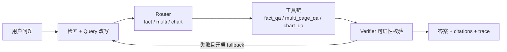

<div align="center">

# AI-Agent-RAG-Question-Answering

**企业级视觉 RAG 与 Agent 编排演示 — 可观测、可开关、可增量建库**

*Visual RAG Q&A with FastAPI: retrieval → routing → multi-tool QA → verification → optional agent loop.*

[](https://www.python.org/)
[](https://fastapi.tiangolo.com/)
[](https://platform.openai.com/docs/api-reference)

</div>

---

## 项目简介

本项目实现一套 **页面级（page-level）** 检索增强生成管线：混合向量与词面信号召回候选页，经规则或 LLM 路由到不同工具链（**事实问答 / 跨页归纳 / 图表读数**），再通过可证性校验与可选的 **Plan–Execute** 循环提升稳健性。内置 **Web 聊天台**（含链路 trace 与提测面板）、**Prometheus 指标**、**离线评测 API** 与 **增量多格式建库**（PDF / Office 等），适合作为 Agent + RAG 的工程化参考实现。

默认偏向 **轻量可跑**：避免大库启动时逐页远程 embedding 与本地 ColPali 占用过高资源；可按环境变量逐步打开企业级能力。

| 项 | 说明 |
|----|------|
| **应用入口** | `uvicorn offer_agent.api:app`（`offer_agent/api.py` → `src.interfaces.api:app`） |
| **主文档** | 本 README；**功能总览**见 [`docs/产品功能总览.md`](docs/产品功能总览.md)；**测试验收**见 [`docs/testing-validation-guide.md`](docs/testing-validation-guide.md)；开关见 **`.env.example`** |
| **隐私资料** | 简历、面试笔记、宣讲 PDF 等请放 **`private/`**（默认不入库，见 `private/README.md`） |

---

## 架构概览



**单轮路径**：`src/pipeline.py` 内「先路由 → 再按分支 top-k 检索 → 工具 → 校验 → 可选扩召回 / 换分支重试」。  
**多轮路径**：校验未通过且开启 `RAG_ENABLE_PLAN_EXECUTE_LOOP` 时，由 `PlanExecuteAgentLoop` 多轮扩 top-k 检索。

---

## 能力一览

| 模块 | 能力说明 |
|------|----------|
| **检索** | Agentic query expansion、RRF 多路融合、类型预过滤、向量 + 词面混合打分；可选远程 embedding / Milvus、可选 ColPali 视觉 rerank |
| **路由** | 三分支：`fact` / `multi` / `chart`；规则优先，可选 LLM / Function Calling |
| **工具链** | `fact_qa` / `multi_page_qa` / `chart_qa`，支持多页与 Excel 多 Sheet 证据合并 |
| **校验** | 规则可证性 + 可选 LLM / VLM 校验；失败可扩 top-k 或分支 fallback 重试 |
| **编排** | 默认 `QAEngine` 主链路；已接入 `LangGraphQAEngine`（`RAG_ENABLE_LANGGRAPH=true` 可切换）；内置 Agentic critique → refine-query → retry；可选 `PlanExecuteAgentLoop`（多轮 retrieve–verify） |
| **可观测** | `/ask` 返回 `trace`（各阶段耗时与分支）；`/metrics` 暴露 Router / Verifier / 缓存等指标 |
| **评测** | `POST /eval/run` 离线跑样本集；`GET /eval/last` 读最近报告；报告落盘 `reports/eval/`（已 gitignore） |
| **服务化** | FastAPI：`/ask`、`/health`、`/capabilities`、`/metrics`；静态托管 `web/chat.html` |
| **建库** | `build_index_incremental.py` 增量扫描 `user_docs/`，输出 `data/user_pages.json` 与页图目录 |

---

## 仓库目录结构

```text
.
├── README.md                      # 对外说明（主文档）
├── .env.example                   # 环境变量与 RAG_* 开关
├── main.py                        # 离线演示与评测入口
├── offer_agent/                   # Uvicorn 包入口（api:app）
├── src/                           # 核心业务
│   ├── pipeline.py                # 主链路编排
│   ├── router.py                  # 三分支路由
│   ├── retriever.py               # 混合检索
│   ├── tools.py                   # fact / multi / chart 工具
│   ├── api.py                     # HTTP 与 Prometheus
│   ├── eval_suite.py              # 离线评测
│   └── infra/                     # Redis 会话、评测报告存储等
├── scripts/
│   ├── one_click_demo.sh          # 一键安装依赖并启动 API（推荐）
│   ├── build_index_incremental.py # 增量建库
│   └── stage3_test_gate.py        # 提测门禁（health / ask+trace / eval）
├── web/chat.html                  # 聊天前端（trace + 提测面板）
├── data/demo_pages.json           # 演示索引（随仓库）
├── private/                       # 本地隐私区（仅 README 可入库）
├── docker-compose*.yml            # 本地或 GPU 云编排
└── requirements*.txt              # Python 依赖
```

> `user_docs/`、`kb_pages/`、`data/user_pages.json`、`reports/eval/` 等由 **`.gitignore`** 排除，请勿将敏感语料提交远程。

---

## 快速开始

> 以下命令均在 **仓库根目录** 执行。

### 1. 获取代码

```bash
git clone https://github.com/NickWilde-AI/AI-Agent-RAG-Question-Answering.git
cd AI-Agent-RAG-Question-Answering
```

### 2. 环境变量

```bash
cp .env.example .env
```

编辑 `.env`，至少配置 **OpenAI 兼容** 对话接口：

| 变量 | 说明 |
|------|------|
| `OPENAI_API_KEY` | API 密钥 |
| `OPENAI_BASE_URL` | 网关地址，如 `https://api.openai.com/v1` 或兼容中转 |
| `OPENAI_CHAT_MODEL` | 对话模型名 |

其余 `RAG_*` 开关见 `.env.example` 注释；默认多为轻量关闭，可按需开启。

### 3. 启动

**一键演示（推荐首次）** — 安装依赖、可选增量建库、后台启动 API：

```bash
bash scripts/one_click_demo.sh
```

| 模式 | 命令 | 说明 |
|------|------|------|
| 轻量（默认） | `bash scripts/one_click_demo.sh` | `RAG_LITE_MODE=1`：不拉 ColPali、不启 Docker Redis，关闭重型 embedding / rerank / Loop |
| 全量链路 | `RAG_LITE_MODE=0 bash scripts/one_click_demo.sh` | ColPali + Redis 等（需本机或 GPU 云资源） |

**本地开发（热重载）**：

```bash
./run_offer.sh
```

等价于：`.venv` + `requirements.txt` + 加载 `.env` 后  
`uvicorn offer_agent.api:app --host 0.0.0.0 --port 8000 --reload`。

### 4. 访问

| 路径 | 用途 |
|------|------|
| [http://127.0.0.1:8000/chat](http://127.0.0.1:8000/chat) | 内置聊天前端（展示 trace、触发评测） |
| [http://127.0.0.1:8000/docs](http://127.0.0.1:8000/docs) | OpenAPI / Swagger |
| [http://127.0.0.1:8000/health](http://127.0.0.1:8000/health) | 健康检查 |
| [http://127.0.0.1:8000/capabilities](http://127.0.0.1:8000/capabilities) | 当前实例已开启能力列表 |
| [http://127.0.0.1:8000/metrics](http://127.0.0.1:8000/metrics) | Prometheus 文本指标 |

服务日志（一键脚本）：`logs/api.log`。

### 5. Docker / 云主机

#### 5.1 仅 API（低配可跑，不含 ColPali）

`Dockerfile` + `docker-compose.yml`：内置 `data/demo_pages.json`，镜像内关闭远程 embedding / ColPali / Plan Loop。

```bash
cp .env.example .env   # 填好 OPENAI_* 等
docker compose up --build
```

安全组放行 **8000**。

#### 5.2 云端 GPU（ColPali + API 分容器）

ColPali 单独容器占 GPU，主 API 经 `http://colpali:9001/rerank` 调用。

```bash
# 权重：scripts/download_colpali_model.py → models/colpali-v1.3
# 自建索引：kb_pages/ + data/user_pages.json（image_path 建议 kb_pages/...）
# 需 NVIDIA 驱动 + nvidia-container-toolkit
cp .env.example .env
docker compose -f docker-compose.cloud-gpu.yml up --build -d
```

无 GPU 的 CPU 云机请勿强上 ColPali，用 **5.1** 即可。详见 `docker-compose.cloud-gpu.yml` 内注释。

---

## 配置说明

- **数据加载**：存在 `data/user_pages.json` 时优先加载，否则回退 `data/demo_pages.json`（见 `src/api.py`）。
- **能力灰度**：真实 embedding、多模态 embedding、ColPali rerank、LLM 路由/校验、Plan–Execute 循环、分支 fallback 等均可通过 `RAG_*` 独立开关，便于对照实验与灰度发布。

**分支 top-k（示例，见 `.env.example`）**

| 分支 | 环境变量 | 默认 |
|------|----------|------|
| 事实 | `RAG_TOPK_FACT` | 3 |
| 跨页 | `RAG_TOPK_MULTI_PAGE` | 5 |
| 图表 | `RAG_TOPK_CHART` | 4 |

---

## 自建知识库索引

将 PDF、XLSX、DOCX、PPTX 等放入 **`user_docs/`**（支持子目录），在已激活的虚拟环境中执行：

```bash
source .venv/bin/activate
python scripts/build_index_incremental.py \
  --input-dir user_docs \
  --output-pages data/user_pages.json \
  --manifest data/index_manifest.json \
  --image-dir kb_pages \
  --lang zh
```

重启 API 后即可检索新索引。

**文档清单**（按类型列出文件名，便于核对入库资料）：

```bash
python scripts/list_user_docs_catalog.py --input-dir user_docs --output data/user_docs_catalog.txt
```

**清空旧索引并全量重建**（`user_docs/` 内原文档保留）：

```bash
RAG_FORCE_REBUILD_KB=1 bash scripts/one_click_demo.sh
```

日常增量建库（含删除文件自动清理）：

```bash
bash scripts/one_click_demo.sh
```

---

## HTTP 接口与提测

### 核心接口

| 方法 | 路径 | 说明 |
|------|------|------|
| `POST` | `/ask` | 问答；响应含 `answer`、`citations`、**`trace`**（路由分支、各阶段耗时等） |
| `GET` | `/health` | 健康检查 |
| `GET` | `/capabilities` | 当前启用的 RAG / 路由 / 校验能力 |
| `GET` | `/metrics` | Prometheus 指标（Router、Verifier、缓存、阶段延迟等） |
| `POST` | `/eval/run` | 触发离线评测，可选落盘 `reports/eval/` |
| `GET` | `/eval/last` | 读取最近一次评测报告 JSON |

### 本地命令

| 命令 | 说明 |
|------|------|
| `python main.py` | 离线演示若干 query 与简化 Recall / Accuracy |
| `python scripts/smoke_test_qa.py --base http://127.0.0.1:8000` | `/ask` 冒烟（需服务已启动） |
| `python scripts/stage3_test_gate.py --base http://127.0.0.1:8000` | **提测门禁**：`/health`、`/ask`+trace、`/eval/run`、`/eval/last` |
| `bash scripts/smoke_vllm_stack.sh` | vLLM 部署冒烟（/health /chat /v1/models /capabilities） |
| `bash scripts/smoke_monitoring_stack.sh` | 监控栈冒烟（Prometheus + Grafana） |
| `bash scripts/lora/run_minicpm_lora_pipeline.sh eval-only` | LoRA 对比评测流水线（默认不训练） |
| `bash scripts/drill_gray_release.sh` | 灰度演练：生成并应用 stable/canary/shadow 权重 |
| `bash scripts/drill_rate_limit.sh` | 限流演练：统计 200/429 比例 |
| `bash scripts/drill_incident_replay.sh` | 故障演练：质量失败样本自动回放 |
| `bash scripts/run_ocr_vs_visual_eval.sh` | 一键产出视觉链路 vs OCR 基线对照报告 |

提测示例（先 `bash scripts/one_click_demo.sh`）：

```bash
python scripts/stage3_test_gate.py --base http://127.0.0.1:8000
```

---

## 安全与合规

- **切勿**将 `.env`、密钥、私有文档或大体积模型推送到公开仓库。
- **`private/`**、**`private.zip`**、本地实验目录 **`pythonProject1/`** 已在 `.gitignore` 中排除。
- 生产环境请配合最小权限密钥、网络隔离与审计日志；本仓库以 **演示与研发** 为主。

---

## 参与贡献

Issue 与 Pull Request 均欢迎。提交前请确认：

1. 未包含密钥、大体积模型或私有语料；
2. 变更与现有 `RAG_*` 开关行为一致，或已在 README / `.env.example` 中说明。

---

## 相关文档

| 资源 | 内容 |
|------|------|
| `.env.example` | 全部 `RAG_*` 与外部服务 URL |
| `docs/产品功能总览.md` | 功能全量清单、开关、运维与验收入口 |
| `docs/kafka-reindex.md` | Kafka 上传事件触发增量建库协议 |
| `src/pipeline.py` | 主链路编排与 fallback |
| `src/retriever.py` | 混合检索与 rerank |
| `src/api.py` | HTTP 入口与指标注册 |

---

## 维护说明

以演示与可扩展实现为主，持续迭代。缺陷与需求请通过 **GitHub Issues** 跟踪；合并请求请尽量附带复现步骤或接口行为说明。
