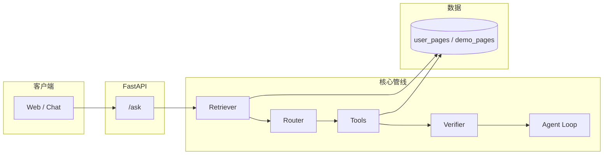

<div align="center">

# AI-Agent-RAG-Question-Answering

**企业级视觉 RAG 与 Agent 编排演示 — 可观测、可开关、可增量建库**

*Visual RAG Q&A stack with FastAPI: retrieval → routing → multi-tool QA → verification → optional agent loop.*

[](https://www.python.org/)
[](https://fastapi.tiangolo.com/)
[](https://platform.openai.com/docs/api-reference)

[功能特性](#-功能特性) · [架构](#-架构一览) · [快速开始](#-快速开始) · [配置说明](#-配置说明) · [自建索引](#-自建知识库索引) · [开发与接口](#-开发与-http-接口)

</div>

---

## 项目简介

本项目实现一套 **页面级（page-level）** 检索增强生成管线：混合向量与词面信号召回候选页，经规则或 LLM 路由到不同工具链（事实问答、跨页归纳、图表读数、翻译等），再通过可证性校验与可选的 **Plan–Execute** 循环提升稳健性。内置 **Web 聊天台**、**Prometheus 指标** 与 **增量多格式建库**（PDF / Office 等），适合作为 Agent + RAG 的工程化参考实现。

默认偏向 **轻量可跑**：避免大库启动时逐页远程 embedding 与本地 ColPali 占用过高资源；可按环境变量逐步打开企业级能力。

---

## 功能特性

| 模块 | 能力说明 |
|------|----------|
| **检索** | Query 改写、类型预过滤、向量 + 词面混合打分；可选远程 embedding / Milvus、可选 ColPali 视觉 rerank |
| **路由** | 规则优先，可选 LLM / Function Calling 分支选择 |
| **工具链** | `fact_qa` / `multi_page_qa` / `chart_qa` / `translate_qa`，支持多页与 Excel 多 Sheet 证据合并 |
| **校验** | 规则可证性 + 可选 LLM / VLM 校验，失败可扩召回重试 |
| **编排** | 可选 `PlanExecuteAgentLoop`（多轮 retrieve–verify） |
| **服务化** | FastAPI：`/ask`、`/health`、`/metrics`；静态托管 `web/chat.html` |
| **建库** | `build_index_incremental.py` 增量扫描 `user_docs/`，输出 `data/user_pages.json` 与页图目录 |

---

## 架构一览



**入口应用**：`uvicorn offer_agent.api:app` → `offer_agent/api.py` 装载 `src.interfaces.api:app`。

---

## 快速开始

> **约定**：以下命令均在 **仓库根目录** 执行。

### 1. 获取代码与虚拟环境

```bash
git clone https://github.com/NickWilde-AI/AI-Agent-RAG-Question-Answering.git
cd AI-Agent-RAG-Question-Answering
```

### 2. 环境变量

```bash
cp .env.example .env
```

编辑 `.env`，至少配置与 **OpenAI 兼容** 的对话接口（用于生成式回答与部分分支）：

| 变量 | 说明 |
|------|------|
| `OPENAI_API_KEY` | API 密钥 |
| `OPENAI_BASE_URL` | 网关地址，例如 `https://api.openai.com/v1` 或兼容中转 |
| `OPENAI_CHAT_MODEL` | 对话模型名 |

其余 `RAG_*` 开关见 `.env.example` 注释；默认多为轻量关闭，可按需开启。

### 3. 启动方式

**一键演示（推荐首次）** — 安装依赖、可选增量建库、后台启动 API：

```bash
bash scripts/one_click_demo.sh
```

- 默认 `RAG_LITE_MODE=1`：不拉 ColPali 依赖、不启 Docker Redis、不启 ColPali 进程，并在进程环境中关闭重型 embedding / rerank / Loop，避免单机资源占满。
- 全量链路（ColPali + Redis 等）：`RAG_LITE_MODE=0 bash scripts/one_click_demo.sh`

**本地开发（热重载）**：

```bash
./run_offer.sh
```

等价于：创建或使用 `.venv`、安装 `requirements.txt`、加载 `.env` 后执行  
`uvicorn offer_agent.api:app --host 0.0.0.0 --port 8000 --reload`。

### 4. 访问

| 路径 | 用途 |
|------|------|
| [http://127.0.0.1:8000/chat](http://127.0.0.1:8000/chat) | 内置聊天前端 |
| [http://127.0.0.1:8000/docs](http://127.0.0.1:8000/docs) | OpenAPI / Swagger |
| [http://127.0.0.1:8000/health](http://127.0.0.1:8000/health) | 健康检查 |
| [http://127.0.0.1:8000/metrics](http://127.0.0.1:8000/metrics) | Prometheus 文本指标 |

服务日志（一键脚本）：`logs/api.log`。

---

## 配置说明

- **数据加载逻辑**：若存在 `data/user_pages.json` 则优先加载，否则回退到随仓库提供的 `data/demo_pages.json`（见 `src/api.py`）。
- **能力灰度**：真实 embedding、多模态 embedding、ColPali rerank、LLM 路由/校验/翻译、Plan–Execute 循环等均可通过环境变量独立开关，便于对照实验与线上灰度。
- **详细清单**：多格式建库与 ColPali 接入状态见根目录 **`PDF功能接入完成度.md`**；面试向技术映射与叙事见 **`README-offer-interview.md`**。

---

## 自建知识库索引

将 PDF、XLSX、DOCX、PPTX 等放入 **`user_docs/`**（支持子目录），在已激活的虚拟环境中执行：

```bash
source .venv/bin/activate
python scripts/build_index_incremental.py \
  --input-dir user_docs \
  --output-pages data/user_pages.json \
  --manifest data/index_manifest.json \
  --image-dir kb_pages \
  --lang zh
```

重启 API 后即可检索新索引。`user_docs/`、`kb_pages/`、`data/user_pages.json` 等默认由 **`.gitignore`** 排除，请勿将敏感资料提交至远程仓库。

---

## 开发与 HTTP 接口

| 命令 | 说明 |
|------|------|
| `python main.py` | 离线演示若干 query 与简化 Recall / Accuracy 评测 |
| `python scripts/smoke_test_qa.py --base http://127.0.0.1:8000` | 对 `/ask` 做冒烟请求（需服务已启动） |

**核心目录**

```text
.
├── offer_agent/          # Uvicorn 包入口（api:app）
├── src/                  # 配置、检索、路由、工具、Pipeline、FastAPI 应用
├── scripts/              # 一键脚本、建库、ColPali 服务、冒烟测试
├── web/chat.html         # 聊天前端
├── data/demo_pages.json  # 演示用页面索引（随仓库）
└── main.py               # 命令行演示与评测入口
```

---

## 安全与合规

- **切勿**将 `.env`、内含密钥的配置或私有文档推送到公开仓库。
- 生产环境请配合最小权限密钥、网络隔离与审计日志；本仓库示例以 **演示与研发** 为主。

---

## 参与贡献

Issue 与 Pull Request 均欢迎。提交前请确认：

1. 未包含密钥、大体积模型或私有语料；
2. 变更与现有 `RAG_*` 开关行为一致或可文档化说明。

---

## 相关链接

| 文档 | 内容 |
|------|------|
| [README-offer-interview.md](./README-offer-interview.md) | 面试向：架构叙事、技术点与代码映射 |
| [PDF功能接入完成度.md](./PDF功能接入完成度.md) | 能力矩阵与建库 / ColPali 落地说明 |

---

## 维护说明

以演示与可扩展实现为主，持续迭代。缺陷与需求请通过 **GitHub Issues** 跟踪；合并请求请尽量附带复现步骤或接口行为说明。

