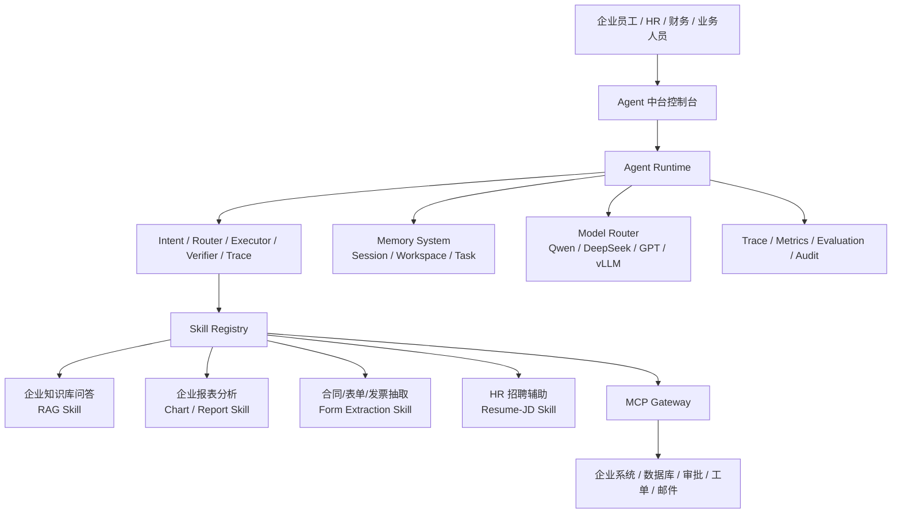

# 企业级 AI Agent 中台 — 产品功能总览与重构路线图

> 本文档记录仓库内**全部可交付能力**、开关、入口命令与架构口径。
> 面向：产品说明、技术评审、面试作品、学习路线与运维交接。
> **公开文档**：位于 `docs/产品功能总览.md`，可随仓库提交至 GitHub。
> 最后更新：2026-06-30

---

## 1. 产品定位

本项目当前定位为 **企业级 AI Agent 中台**：以已经实现的企业多模态 RAG+Agent 为核心底座，将其抽象为第一个真实可用的 **RAG Skill**，再向四个企业高频场景扩展：

1. **企业知识库问答**
2. **企业报表分析**
3. **合同 / 表单 / 发票抽取**
4. **HR 招聘辅助**

本阶段不把会议纪要、机器人控制、泛化办公 Agent 作为主线。会议纪要已有飞书/钉钉/腾讯会议等成熟能力；机器人/具身智能属于后续专项，不写入本阶段企业中台主线。

中台目标不是做四套孤立系统，而是沉淀一套可复用能力：

- **RAG Skill**：当前真实核心，封装多模态文档检索、页图证据、三分支 Router、VLM 生成、Verifier 和评测。
- **Agent Runtime 雏形**：当前已具备路由、检索、生成、校验、Fallback、SSE Trace、研究任务等主体能力；后续可抽象为通用 Runtime。
- **业务 Skill 化**：企业报表、合同表单发票、HR 招聘辅助都复用 RAG/VLM/结构化抽取/证据校验链路。
- **MCP / 工具接入**：保留企业系统、数据库、审批、工单等工具接入能力。
- **Evaluation / Observability**：保留金标集、MRR/Recall/Relaxed EM、Router Accuracy、Verifier 指标、Prometheus/Grafana/Sentry 接入点。

### 1.0 当前真实能力

- **当前真实可用核心**：企业多模态 RAG+Agent 主体闭环，包括页面级建库、RAG 检索、三分支 Router、VLM 页图推理、Verifier/Fallback、SSE Trace、Workspace 资料空间、评测和金标工具。
- **研究闭环**：Workspace → Planner/Router → RAG 工具执行与校验 → Evidence → Markdown/HTML 报告。
- **RAG 三分支**：`fact_qa` / `multi_page_qa` / `chart_qa`。
- **编排方式**：默认自研 `pipeline.QAEngine`；可选 QA LangGraph；复杂研究可选 Planner / Executor / Verifier 多角色 LangGraph。
- **页面现状**：`web/chat.html` 保留现有 RAG 问答入口；`web/agent_platform.html` 已升级为可调用 `/agent-center/run` 的 Agent 中台页，API 不可用时自动回退 mock 结果。

### 能力口径

- **已实现主体**：页面级入库、稳定 ID、增量重建、混合检索、Query Rewrite、三分支 Router、VLM adapter、Verifier、Fallback、Session 缓存、Workspace 隔离、SSE Trace、研究任务、评测与金标工具。
- **可复用扩展**：企业报表分析可复用 `chart_qa` 和 VLM 页图理解；合同/表单/发票抽取可复用 VLM + 结构化 schema；HR 招聘辅助可复用文档解析、多文档对比、结构化输出和证据引用。
- **展示 + 运行页**：`web/agent_platform.html` 同时承担 Agent 中台展示和 Skill 运行入口；其中合同/发票、HR 等能力仍需继续补业务 schema、权限、人工确认和评测集后才算产品化完成。
- **可选配置**：OpenAI-compatible、Redis、Milvus、ColPali、VLM、LangGraph；轻量模式无需这些外部服务即可启动。
- **模型口径**：千问 API 或其他 OpenAI-compatible API 是开发期模型适配方式；生产口径是模型中立和私有化部署，可切换到企业自有模型或 vLLM Serving。
- **生产边界**：Milvus、ColPali、Redis、Kafka、Prometheus/Grafana/Sentry、灰度配置等接入点已保留，但百万页规模、万人并发、具体 MRR/延迟数字需要目标环境重新评测和压测后归档。

---

## 1.1 企业 AI Agent 中台完整设计



### 1.1.1 控制台页面应呈现的模块

| 页面模块 | 展示内容 | 当前状态 |
|---|---|---|
| 总览大屏 | 当前能力、四大业务功能、模型/检索/评测/生产接入状态 | 已在前端展示，静态为主 |
| 已实现能力 | 页面级建库、三分支 Router、VLM 页图推理、Verifier/Fallback、Workspace、Trace、Eval | 已在 `web/agent_platform.html` 展示 |
| Agent Runtime | Intent → Router → Executor → Verifier → Trace 的执行链路 | 已有 RAG/研究链路雏形，需抽象为通用 Runtime |
| Skill 分类 | RAG Skill、企业报表分析、合同/表单/发票抽取、HR 招聘辅助 | RAG Skill 已实现主体，其余可复用扩展 |
| MCP Gateway | MCP Server/Client、工具发现、参数校验、工具权限、调用审计 | 已有 MCP Server 基础，Gateway 规划中 |
| Memory | 会话记忆、任务记忆、Workspace 隔离、Session QA 缓存 | 部分已实现 |
| Model Router | OpenAI-compatible、Qwen、DeepSeek、GPT、本地 vLLM | 现有 OpenAI-compatible 基础，路由规划中 |
| 监控与评测 | SSE Trace、Prometheus、金标评测、审计日志 | 部分已实现 |

### 1.1.2 四大业务 Skill

| Skill | 业务价值 | 核心技术 | 当前状态 |
|---|---|---|---|
| 企业知识库问答 | 企业制度、产品手册、PPT、项目文档、规格说明书问答 | 多模态 RAG、三分支 Router、VLM 页图推理、Verifier、Evidence Trace | 当前主体已实现 |
| 企业报表分析 | 经营报表、Excel、PPT 图表、KPI 看板问答和简单计算 | `chart_qa`、VLM 图表理解、数值抽取、Relaxed EM、Verifier | 已有基础 |
| 合同/表单/发票抽取 | 合同、采购单、验收单、发票、报销单字段抽取和证据定位 | VLM/OCR、Key-Value Extraction、JSON schema、字段校验、脱敏 | 可复用实现，需补 schema |
| HR 招聘辅助 | 简历解析、JD 匹配、候选人亮点/风险总结、面试题生成 | 文档解析、多文档对比、实体抽取、匹配矩阵、证据引用 | 可扩展实现，需补模板和合规边界 |

### 1.1.3 技术栈与项目落点

| 方向 | 技术 | 项目中如何体现 |
|---|---|---|
| Agent 底座 | Router、Executor、Verifier、Trace、Fallback、可选 LangGraph | 当前 RAG+Agent 已具备主体链路，后续抽象为通用 Runtime |
| RAG Skill | Hybrid Search、BM25、VLM、page_id、Evidence Trace | 现有 RAG 升级为第一个真实 Skill，保留页级证据 |
| 多模态理解 | VLM Adapter、OCR/Layout Parsing、Chart QA、Page Image Reasoning | 支撑报表、发票、合同、扫描件、图表、PPT 页面理解 |
| 结构化抽取 | JSON schema、字段置信度、Key-Value Extraction、字段级 Verifier | 支撑合同/表单/发票抽取和 HR 匹配矩阵 |
| MCP / Tool | MCP Server、Function Calling、Tool Schema、权限、超时、Fallback | 统一接入企业系统和工具，避免业务代码强耦合 |
| Memory | Session Memory、Workspace Memory、QA Cache、TTL | 支撑多轮问答、历史问题和资料空间 |
| 评测观测 | SSE、MRR@10、Recall@K、Relaxed EM、Router Accuracy、Prometheus | 支撑效果回归、运行追踪和生产监控 |
| 工程化 | FastAPI、Docker、Milvus/Qdrant、Redis、Kafka、JWT、ACL、灰度配置 | 体现生产化接入点，但真实规模需部署压测 |

### 1.1.4 四大功能统一执行链路

```text
用户问题 / 文件上传
  → 文档解析与页面级建库
  → RAG 检索召回相关页面
  → Router 判断任务类型
  → 选择对应 Skill
      ├── 企业知识库问答
      ├── 企业报表分析
      ├── 合同/表单/发票抽取
      └── HR 招聘辅助
  → VLM / LLM 处理
  → Verifier 校验证据
  → 结构化结果 + 证据页 + Trace
```

关键原则：

- **四个功能共用底座**：不为每个业务场景重写系统。
- **答案必须可追溯**：最终答案需要回到原始页面证据。
- **结构化输出必须有 schema**：合同/发票/HR 等结果不能只输出自由文本。
- **执行过程必须可观测**：面试和生产都需要 trace、阶段耗时、失败原因和评测闭环。

### 1.1.5 分阶段实施计划

| 阶段 | 目标 | 交付物 |
|---|---|---|
| Phase 1：RAG Skill 标准化 | 把当前 RAG+Agent 封装为标准 Skill | input/output schema、证据页、Trace、Verifier |
| Phase 2：企业报表分析 | 增强 `chart_qa` 和数值问答 | 数值抽取、计算过程、报表评测样本 |
| Phase 3：合同/表单/发票抽取 | 结构化字段抽取 | 字段 schema、字段级 Verifier、脱敏、人工确认 |
| Phase 4：HR 招聘辅助 | 简历/JD 匹配报告 | 简历/JD schema、匹配矩阵、面试题生成、合规边界 |
| Phase 5：中台化能力沉淀 | 平台能力抽象 | Skill Registry、MCP Gateway、权限审计、统一评测 |
| Phase 6：生产化 | 面向私有化部署和企业容量基线 | vLLM、Milvus/Qdrant、Redis、Prometheus、压测、权限审计 |

### 1.1.6 当前边界

- 当前最成熟能力是 **企业知识库问答 / RAG Skill**。
- 企业报表分析已有 `chart_qa` 和 VLM 页图理解基础。
- 合同/表单/发票抽取与 HR 招聘辅助可以复用现有底座，但需要补业务 schema、权限、人工确认和专项评测集。
- 千问 API 或其他 OpenAI-compatible API 只是开发阶段的模型适配方式；项目应保持模型中立，生产可切换到企业私有模型或 vLLM Serving。
- 本阶段不把会议纪要、机器人/具身智能控制作为主线能力。

---

## 2. 一键启动

```bash
bash scripts/one_click_demo.sh
```

- 安装依赖、可选建库、后台起 API（默认 `http://127.0.0.1:8000`）。
- RAG 问答页：`/chat`；Agent 中台页面：`/agent-platform`。
- 健康检查：`/health`；能力探测：`/capabilities`。

### 2.1 部署资源口径

- 轻量模式可关闭 vLLM、ColPali、Milvus 和 Redis，在普通开发机运行。
- 面向万人员工与十万级文档场景时，可将 API、检索服务、Research Worker 和模型 Serving 独立扩容，并按模型、页面量、并发和延迟目标确定部署规格。
- SQLite + 进程内 dispatcher 提供默认运行后端；生产环境可沿 Repository 与 Dispatcher 接口替换为分布式持久化实现。

---

## 3. 在线问答（核心产品）

| 能力 | 说明 | 配置 / 代码 |
|---|---|---|
| 单轮问答 | `POST /ask`（同步）/ `POST /ask/stream`（SSE） | `src/api.py` |
| 多轮 Plan-Execute | 扩 top-k、多步 trace | `RAG_ENABLE_PLAN_EXECUTE_LOOP=true` |
| LangGraph 编排 | 图状态机版 QA | `RAG_ENABLE_LANGGRAPH=true`，`src/langgraph_engine.py` |
| 多角色研究编排 | Planner Agent → Executor Agent → Verifier Agent | `RAG_ENABLE_RESEARCH_LANGGRAPH=true`，`src/research_graph.py` |
| Query Rewrite | 术语扩展 | `RAG_ENABLE_QUERY_REWRITE` |
| LLM Router | Function Calling 选分支 | `RAG_ENABLE_LLM_ROUTER` |
| LLM Verifier | 答案校验 | `RAG_ENABLE_LLM_VERIFIER` |
| 分支 Fallback | 校验失败换分支重试 | `RAG_ENABLE_BRANCH_FALLBACK` |
| 会话缓存 | memory / redis | `RAG_SESSION_BACKEND`，`src/memory.py` |
| 限流 | `/ask`、`/ask/stream`、研究提交和上传按客户端令牌桶限流，429 | `RAG_ENABLE_RATE_LIMIT`，`src/middleware_ops.py` |
| Router 熔断 | LLM 连续失败 → 规则路由 | `RAG_ENABLE_ROUTER_CIRCUIT_BREAKER`，`src/resilience.py` |
| VLM 熔断 | VLM 连续失败 → 文本链路降级 | `RAG_ENABLE_VLM_CIRCUIT_BREAKER`，`src/services.py` |
| LLM 指数退避 | 外部 API 重试 | `RAG_LLM_MAX_RETRIES`，`src/llm_client.py` |
| 匿名多对话 | 自动 client ID、历史列表、新建/切换/删除 | `src/api.py`、`web/chat.html`、SQLite |
| 企业权限 | HS256 JWT + Workspace user/group ACL | `RAG_ENABLE_AUTH=true`、`src/auth.py` |
| MCP Server | 检索、QA、三分支工具、研究计划 | `python scripts/mcp_server.py` |

**Agent 执行过程**：即时问答通过 `POST /ask/stream` 实时推送路由、检索、生成、校验和重试事件；复杂研究通过 `GET /research/jobs/{job_id}/events` 推送规划、工具执行、证据校验和报告事件，并支持 `Last-Event-ID` 续传。前端展示的是可审计执行事件和工具结果，不暴露模型私有 chain-of-thought。

普通问答已经是自适应 Agentic RAG（route → retrieve → tool → verify → critique/retry）；复杂研究模式再叠加显式 Planner 与多步 Plan-Execute。两者不是同一个复杂度档位。

### 3.1 Agent Center API

| 接口 | 说明 | 当前状态 |
|---|---|---|
| `GET /agent-center/skills` | 返回四个 Skill 的 `SkillSpec` 列表 | 已实现 |
| `GET /agent-center/skills/{skill_name}` | 查看单个 Skill 元数据、状态、示例问题、schema | 已实现 |
| `POST /agent-center/run` | 统一执行入口，返回 `SkillResult` | 已实现 |

当前 Skill 状态口径：

- `rag`：`implemented`，真实复用现有 QAEngine / workspace engine。
- `report_analysis`：`partial`，支持占比/差值/极值/求和等计算，输出可追溯 `formula`/`inputs`/`confidence`；有计算 gold set 覆盖。
- `form_invoice`：`partial`，字段级 schema(value/source/confidence/verified/masked)+ 字段格式校验 + 敏感字段脱敏。
- `hr_recruiting`：`partial`，技能匹配矩阵 + 匹配分 + 敏感属性合规拦截(涉及年龄/性别/民族/婚育的提问返回 `unsupported`)。

> 三个业务 Skill 的内部逻辑已完备并有测试覆盖；因当前仓库缺大规模真实语料与标注 gold set，
> 状态如实保留为 `partial`，不声称生产级准召率。

**Prometheus 指标**：`GET /metrics`
主要指标：`rag_requests_total`、`rag_request_latency_seconds`、`rag_fallback_total`、`rag_router_rule_fallback_total`、`rag_bm25_fallback_total`、`rag_vlm_fallback_total`、`rag_stage_latency_seconds` 等。

---

## 4. 检索与向量库

| 能力 | 说明 | 配置 |
|---|---|---|
| 内存向量库 | 默认可离线演示 | `RAG_VECTOR_BACKEND=inmemory` |
| Milvus | 生产向量后端 | `RAG_VECTOR_BACKEND=milvus` |
| 真实 Embedding | MiniCPM-V / 多模态 HTTP | `RAG_ENABLE_REAL_EMBEDDING`，`RAG_MULTIMODAL_EMBEDDING_API` |
| 分层候选召回 | 文档聚合粗排后再做页级候选筛选 | `RAG_ENABLE_HIERARCHICAL_RETRIEVAL` |
| 混合 BM25 | 与向量、词面和 RRF 常态融合；Embedding 故障时继续降级 | `RAG_ENABLE_HYBRID_BM25` |
| 千问视觉重排 | 无 GPU 阶段，对少量候选页调用 API 进行相关性排序 | `RAG_ENABLE_VISUAL_RERANK` |
| ColPali 重排 | Milvus 粗召后精排 | `RAG_ENABLE_COLPALI_RERANK`，`RAG_COLPALI_RERANK_API` |
| 文档类型预过滤 | form / report / ppt | `src/retriever.py` `infer_doc_type` |

**增量建库**：`python scripts/build_index_incremental.py`（`one_click_demo.sh` 可触发）。轻量模式默认跳过 PDF 页图渲染；manifest 使用相对路径并逐文件原子 checkpoint。

**Kafka 触发增量建库**：`scripts/kafka_consumer_reindex.py`，协议见 `docs/kafka-reindex.md`。

**可选每日全量保险**：`bash scripts/nightly_full_rebuild.sh`。

---

## 5. 模型与外部服务

| 组件 | 角色 | 部署 / 脚本 |
|---|---|---|
| **MiniCPM-V 2.6** | 多模态 embedding / VLM 生成 | `deploy/compose/docker-compose.vllm.yml`，`RAG_VLM_API` |
| **ColPali** | Late-interaction 重排 | `scripts/colpali_rerank_service.py`，`deploy/compose/docker-compose.cloud-gpu.yml` |
| **vLLM** | 推理 Serving（OpenAI 兼容） | `OPENAI_BASE_URL` 指向 vLLM |
| **VLM Gateway** | 统一转发 VLM 请求 | `scripts/vlm_gateway.py` |
| **OpenAI 兼容 API** | Router / Verifier / 文本生成 | `OPENAI_API_KEY`，`OPENAI_BASE_URL` |
| **千问 VL 页面解析** | 建库时将扫描页、表格、图表、流程图转结构化 Markdown | `bash scripts/one_click_demo.sh --qwen`，`RAG_VISION_PARSER_MODEL` |
| **千问在线视觉链路** | flash 重排候选页，plus 生成，flash 校验 | `RAG_QWEN_VLM_RERANK_MODEL`、`RAG_QWEN_VLM_MODEL`、`RAG_QWEN_VLM_VERIFIER_MODEL` |

当前千问 API 与未来自部署模型共用 `MultimodalEmbeddingClient`、`ColPaliRerankClient`、`VLMClient` 适配边界。服务器就绪后通过环境变量切换服务地址，不修改 Router、Pipeline、Tool 和 Verifier。

**明确不做**：`translate_qa` 分支；**LoRA 仅 MiniCPM-V**，不微调 ColPali。

---

## 6. LoRA（MiniCPM-V）

| 脚本 | 用途 |
|---|---|
| `scripts/lora/prepare_sft_data.py` | SFT 数据准备 |
| `scripts/lora/train_minicpm_lora.py` | QLoRA 训练 |
| `scripts/lora/eval_lora_checkpoint.py` |  checkpoint 评测 |
| `scripts/lora/merge_lora_adapter.py` | 合并 adapter |
| `scripts/lora/summarize_lora_eval.py` | LoRA 对比结果汇总（JSON+MD） |
| `scripts/lora/run_minicpm_lora_pipeline.sh` | 一键：数据准备→训练(可选)→评测对比→汇总 |
| `configs/lora/minicpm_v26_qlora.yaml` | 训练超参 |

训练依赖（可选）：`transformers`、`peft`、`torch` 等，见脚本 `--help`。

---

## 7. 评测与数据闭环

| 脚本 | 用途 |
|---|---|
| `scripts/gen_eval_candidates.py` | 模型生成 query-answer 候选 |
| `scripts/filter_eval_queries.py` | A/B 类过滤 |
| `scripts/version_eval_dataset.py` | 版本打包 `data/eval_sets/vYYYYMMDD/` |
| `scripts/run_eval_pipeline.sh` | 一键：生成→过滤→版本化→质量评测 |
| `scripts/build_gold_candidates.py` | 千问批量生成单页/跨页金标候选，支持断点续跑 |
| `scripts/gold_review_server.py` | 仅本机开放的页图审核页面，接受/修改/拒绝候选 |
| `scripts/import_gold_json.py` | 将外部模型生成的页码型 JSON 映射为真实 page_id 后导入审核库 |
| `scripts/export_gold_dataset.py` | 仅导出人工接受记录为版本化 `gold.jsonl` |
| `scripts/run_gold_eval.py` | 计算 MRR、Recall、答案/路由准确率并输出 JSON+Markdown |
| `scripts/compare_eval_reports.py` | 对比两版评测报告（默认最近两版） |
| `scripts/run_quality_eval.py` | 质量回归 |
| `scripts/run_ocr_baseline_eval.py` | 视觉链路 vs OCR 对照（离线） |
| `scripts/compare_ocr_vs_visual.py` | 固定格式对照报告（JSON+MD） |
| `scripts/run_ocr_vs_visual_eval.sh` | 一键：视觉评测 + OCR 基线 + 对照汇总 |
| `POST /eval/run`、`GET /eval/last` | API 触发 / 读取最近报告 |

评测产物目录规范：`data/eval_sets/<version>/meta.json` + `gold.jsonl`；候选、审核数据库和报告默认不进入 Git。

---

## 8. 可观测与运维

| 能力 | 启动方式 |
|---|---|
| Prometheus + Grafana + Alertmanager | `docker compose -f deploy/compose/docker-compose.monitoring.yml up -d` |
| 告警规则 | `monitoring/alert_rules.yml`（p99、fallback、verifier） |
| Grafana 面板 | `monitoring/grafana/dashboards/rag-overview.json` |
| Sentry | `SENTRY_DSN`，已按 `api/router/verifier/retriever/vlm` 打标签 |
| 灰度配置生成 | `python scripts/release_rollout.py --primary 5 --shadow 5` |
| 灰度权重落地 | `python scripts/apply_release_rollout.py`（JSON 同步到 Traefik） |
| 灰度演练脚本 | `bash scripts/drill_gray_release.sh` |
| 限流演练脚本 | `bash scripts/drill_rate_limit.sh`（统计 429 比例） |
| 故障回放演练 | `bash scripts/drill_incident_replay.sh`（质量回归失败样本自动回放） |
| 并发容量压测 | `python scripts/load_test.py --mode mixed --stages 10:10,50:20,100:30` |
| Traefik 灰度示例 | `docker compose -f deploy/compose/docker-compose.gateway.yml up -d` |
| vLLM 栈冒烟 | `bash scripts/smoke_vllm_stack.sh` |
| 监控栈冒烟 | `bash scripts/smoke_monitoring_stack.sh` |

**灰度说明**：`release_rollout.py` 产出 JSON 比例；真实切流需网关（Traefik/Nginx）按权重转发 stable/canary/shadow。

---

## 9. 配置速查（.env）

复制 `.env.example` → `.env`。关键项：

```bash
RAG_ENABLE_LANGGRAPH=false
RAG_ENABLE_LLM_ROUTER=false
RAG_ENABLE_LLM_VERIFIER=false
RAG_QWEN_VLM_MODEL=qwen3-vl-plus
RAG_QWEN_VLM_VERIFIER_MODEL=qwen3-vl-flash
RAG_ENABLE_BM25_FALLBACK=true
RAG_ENABLE_RATE_LIMIT=true
RAG_ENABLE_ROUTER_CIRCUIT_BREAKER=true
RAG_ENABLE_VLM_CIRCUIT_BREAKER=true
SENTRY_DSN=
RAG_VLM_API=
OPENAI_BASE_URL=
MILVUS_URI=http://localhost:19530
```

完整列表见 `.env.example` 与 `src/config.py` `Settings`。

---

## 10. 企业 AI Agent 中台里程碑对照

| 里程碑 | 验收项 |
|---|---|
| **M0 当前基线** | 多模态 RAG、Workspace、SSE trace、研究任务、MCP 基础服务、权限边界 |
| **M1 中台展示完成** | `web/agent_platform.html` 展示四大企业功能、已实现能力、RAG Skill、Runtime 链路和工程边界 |
| **M2 RAG Skill 标准化** | 已落地 `src/agent_center/`、统一 `SkillSpec`/`SkillResult`、`/agent-center/*` API 和可运行前端入口 |
| **M3 企业报表分析** | 增强 `chart_qa`，支持数值抽取、计算过程、报表类评测集 |
| **M4 合同/表单/发票抽取** | 定义字段 schema、字段级 Verifier、脱敏、人工确认和字段级评测 |
| **M5 HR 招聘辅助** | 定义简历/JD schema、匹配矩阵、面试题生成、合规边界和人工复核 |
| **M6 中台化能力沉淀** | Skill Registry、MCP Gateway、权限审计、统一评测、Model Router 进入真实后端 |
| **M7 生产化** | vLLM / Milvus / Redis / Prometheus / OpenTelemetry / 金标评测 / 压测 / 权限审计形成生产基线 |

**Backlog（非必须）**：GraphRAG、A2A、企业 MCP 网关策略中心、embedding 双副本切换、Oracle/拼接对照实验脚本。

---

## 11. 文档索引

| 文档 | 内容 |
|---|---|
| `README.md` | 公开仓库说明、编排开关 |
| `docs/README.md` | docs 目录导航：推荐阅读顺序、主线文档、归档候选 |
| `docs/kafka-reindex.md` | Kafka topic、幂等、DLQ |
| `docs/产品功能总览.md` | **本文档**（Agent 中台功能全量清单、路线图、边界说明，公开可提交） |
| `docs/企业级AI Agent中台项目.md` | 新版正式项目文档：四大企业功能、统一技术底座、评测、生产化和面试 QA |
| `docs/企业多模态研究Agent架构与API.md` | Workspace / ResearchJob / API 与运行边界 |
| `docs/robot_agent_runtime_architecture.md` | Robot Agent Runtime 架构图与 SVG；属于后续专项资料，不是当前企业中台主线 |
| `docs/项目改造对话记录_20260625.md` | 项目改造过程记录；已追加 2026-06-30 四大功能收敛决策 |
| `private/多模态知识库问答RAG+Agent项目.md` | 导师版完整技术叙事，仅本地参考 |
| `private/多模态知识库问答RAG+Agent项目_QA版.md` | 导师版 QA 面试资料，仅本地参考 |
| `private/导师文档实现度审计.md` | 导师文档与当前仓库实现度核对，仅本地参考 |

### 11.1 文档整理建议

当前 MD 文档已经偏多，建议先按“公开文档 / 私有参考 / 归档资料”三类管理，暂时不要贸然删除。

建议目录口径：

```text
docs/
  产品功能总览.md                         # 公开总入口，保持短而准
  企业级AI Agent中台项目.md               # 新版正式项目文档
  企业多模态研究Agent架构与API.md          # API / Workspace / ResearchJob 技术说明
  testing-validation-guide.md             # 测试与验证
  kafka-reindex.md                        # Kafka 增量建库
  assets/                                 # 架构图 SVG / PDF
  archive/                                # 旧提示词、旧改造记录、过时方案

private/
  多模态知识库问答RAG+Agent项目.md          # 导师版原始资料
  多模态知识库问答RAG+Agent项目_QA版.md      # 导师版 QA
  导师文档实现度审计.md                    # 实现度审计
  简历与面试材料                           # 不提交公开仓库
```

建议下一步如果要真正整理文件，可以把以下文件移动到 `docs/archive/`：

- `docs/企业多模态研究Agent增量升级提示词.md`
- `docs/项目改造对话记录_20260625.md`（如果不再频繁更新）
- 旧的机器人专项图文档（若当前阶段不使用）

移动前建议先确认是否已经被 README 或其他文档引用，避免链接失效。

---

## 12. 变更记录

| 日期 | 内容 |
|---|---|
| 2026-05-26 | 初版：汇总 LangGraph、Kafka、vLLM、监控、评测闭环、LoRA、BM25、限流熔断、灰度网关、Sentry |
| 2026-05-26 | 补充 `compare_eval_reports.py`、Kafka 重试/DLQ 与 topic 兼容变量说明 |
| 2026-05-26 | 补充 vLLM/监控冒烟脚本、VLM 熔断开关与可观测字段 |
| 2026-05-26 | 补充 LoRA 一键流水线、灰度权重同步脚本、限流/灰度演练脚本 |
| 2026-05-26 | 补充失败用例回放链路、OCR vs 视觉一键对照报表、retriever/vlm Sentry 标签 |
| 2026-05-26 | 补充预算版服务器配置建议（CPU/GPU/内存/磁盘） |
| 2026-06-20 | 增加 SSE 执行时间线、匿名持久会话、并发压测脚本和轻量建库优化 |
| 2026-06-29 | 将产品定位升级为企业级 Agent 中台；新增独立 `web/agent_platform.html` 展示页；补充 Agent 市场、Skill Registry、MCP Gateway、Memory/Wiki、Model Router、人形机器人/车载设备、具身智能 Safety Gate、生产化里程碑和当前能力边界 |
| 2026-06-30 | 将项目主线从泛化 Agent/机器人扩展收敛为企业级 AI Agent 中台四大功能：企业知识库问答、企业报表分析、合同/表单/发票抽取、HR 招聘辅助；新增 `docs/企业级AI Agent中台项目.md`；更新 `web/agent_platform.html` 和文档整理建议 |
| 2026-06-30 | 三个业务 Skill 逻辑做扎实：report_analysis 补占比/差值/极值/求和计算与 gold set；form_invoice 升级为字段级 schema(value/source/confidence/verified/masked)+ 校验 + 脱敏；hr_recruiting 补技能匹配矩阵/匹配分与敏感属性合规拦截及评测样本。修复 `langgraph` 版本不兼容(固定 0.2.x 配套 langchain-core 0.2.x，恢复真实编排链路)。新增 `tests/test_agent_center.py` 计算/脱敏/合规断言 |
| 2026-06-30 | 新增 `src/agent_center/`、统一 `SkillSpec`/`SkillResult`、`GET /agent-center/skills`、`GET /agent-center/skills/{skill_name}`、`POST /agent-center/run`；`/agent-platform` 页面支持真实调用与 mock fallback |
| 2026-07-01 | 前端 `web/agent_platform.html` 视觉重做为现代 SaaS 控制台风格（浅灰底 + 白卡片 + 单一靛蓝主色，去除多层渐变/毛玻璃）；新增结构化结果可视化：报表计算卡+公式、合同字段表+脱敏/校验标记、HR 技能匹配矩阵进度条+匹配分徽章、合规拦截提示；补 loading 态、Answer 复制、Cmd/Ctrl+Enter 快捷运行；原始 JSON 收进可折叠区。逻辑与所有 DOM id 保持不变 |
| 2026-07-01 | 中台层企业级治理 P0：`/agent-center/run` 纳入 `RateLimitMiddleware` 限流白名单（堵住绕过限流直打底层 LLM/检索的通道）；新增 skill 级 Prometheus 指标 `agent_center_skill_total`（skill/status 维度）与 `agent_center_skill_latency_seconds`，在 run 端点埋点计时 |
| 2026-07-01 | 中台层企业级治理 P1：新增 skill 级/risk 级权限门禁 `_require_skill_permission`——高危 Skill（form_invoice/hr_recruiting）需 hr/finance/analyst/admin 角色，低危 rag 不受限，角色清单走 `RAG_AGENT_HIGH_RISK_ROLES` 配置（`SkillSpec.risk_level` 字段首次用于鉴权）；`AgentCenterRuntime.run` 失败不再静默，加 Sentry `capture_exception` + 结构化异常日志；run 端点记结构化审计日志（actor/roles/skill/workspace/status/evidence_count/compliance_blocked/elapsed）。新增 `test_skill_level_permission_gate`、`test_agent_skill_metrics_exposed`，中台+企业测试合计 13 passed |
| 2026-07-01 | 文档强化：`docs/企业级AI Agent中台项目.md` §1.3 明确四个 Skill 为首批示范而非能力上限（考勤/审批/工单等可按同一契约接入），§3 补充“RAG 是共享底座层 + 统一契约”心智模型；`private/` 面试文档（完整版 + QA 版）同步“底座+契约提供方”定位、可扩展性表述与权限真实进度 |
| 2026-07-01 | 依赖治理记录：`langgraph` 未固定版本导致被装成 1.2.6 而 `langchain-core` 停留 0.2.43，新版 checkpoint 调 `Reviver(allowed_objects=...)` 触发 TypeError 使编排链路静默降级；已降级 langgraph 至 0.2.76（配套 checkpoint 2.1.2）、清理孤儿包 langgraph-prebuilt、在 `requirements.txt` 固定 `langgraph>=0.2.74,<0.3` + `langchain-core>=0.2.40,<0.3` 并加注释，恢复真实 `langgraph.graph.state.StateGraph` 链路 |

### 12.1 当前能力边界与下一步（截至 2026-07-01）

- **已落地**：RAG 检索底座 + Skill 抽象框架（SkillSpec/SkillResult/Registry/Runtime）+ 四个 Skill + `/agent-center/*` API + 前端控制台 + 中台层限流/监控/RBAC 权限/审计日志；RAG Skill 为 `implemented`，其余三个 `partial`（逻辑完备有测试，缺大规模真实语料）。
- **规划中（诚实标注，未落地）**：账号注册/登录接口（当前 JWT 由外部 SSO 签发）、行级数据权限（如 HR 只看自己 owner_id 的候选人，依赖候选人档案落库）、招聘面试状态机与候选人档案持久化、MCP Gateway、业务 Skill 规模化评测。
- **架构定位**：单 RAG 底座 + Router 分发 + 契约化 Skill 的**确定性编排**，非多 Agent 自主协商——对确定性企业流程更可控、低延迟、可复现；重工作流（如招聘全流程）的多步 Agent 编排列为后续演进方向。
