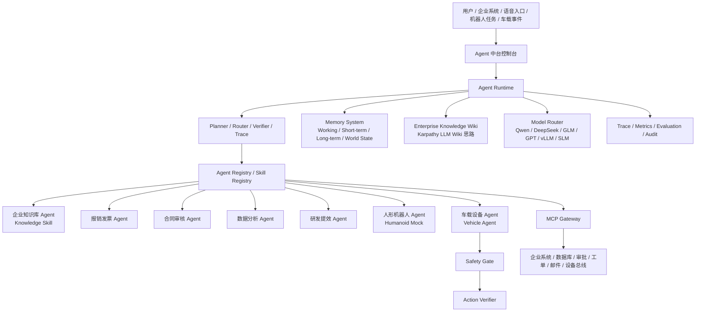

# 企业级 Agent 中台 — 产品功能总览与重构路线图

> 本文档记录仓库内**全部可交付能力**、开关、入口命令与架构口径。  
> 面向：产品说明、技术评审、面试作品、学习路线与运维交接。
> **公开文档**：位于 `docs/产品功能总览.md`，可随仓库提交至 GitHub。  
> 最后更新：2026-06-29

---

## 1. 产品定位

本项目下一阶段定位为 **企业级 Agent 中台**：一个用于创建、管理、运行和观测企业 Agent 的平台。
原有“企业多模态 RAG 问答”不删除，而是沉淀为中台内置的 **Knowledge Skill / 企业知识库 Agent**。

中台目标不是只做一个聊天框，而是提供：

- **Agent Runtime**：负责意图理解、计划、路由、执行、校验、重试、轨迹记录。
- **Agent / Skill 市场**：沉淀企业知识库、报销发票、合同审核、数据分析、研发提效、人形机器人、车载设备、VLM 场景理解等 Agent 模板。
- **MCP Gateway**：统一接入数据库、审批、工单、邮件、知识库、设备总线等企业系统。
- **Memory / Wiki**：支持会话记忆、长期用户偏好、任务状态、企业知识 Wiki 与具身场景 World State。
- **Model Router**：保持模型中立，支持 Qwen、DeepSeek、GLM、GPT、企业私有模型、本地 vLLM 和端侧 SLM。
- **Safety / Governance**：提供权限、审计、工具调用安全、动作风险分级和具身智能 Safety Gate。
- **Observability / Evaluation**：提供 SSE Trace、Prometheus、评测集、金标数据和轨迹级评估。

### 1.0 当前真实能力

- **当前真实可用核心**：企业多模态 RAG 检索、即时问答、复杂研究、SSE trace、Workspace 资料空间、评测、MCP 基础服务和权限边界。
- **研究闭环**：Workspace → Planner → RAG 工具执行与校验 → Evidence → Markdown/HTML 报告。
- **RAG 三分支**：`fact_qa` / `multi_page_qa` / `chart_qa`。
- **编排方式**：默认自研 `pipeline.QAEngine`；可选 QA LangGraph；复杂研究可选 Planner / Executor / Verifier 多角色 LangGraph。
- **页面现状**：`web/chat.html` 保留现有 RAG 问答入口；新增 `web/agent_platform.html` 作为 Agent 中台独立展示页，用于学习、面试讲解和路线图展示。

### 能力口径

- **已实现**：SQLite 研究真源、空间 CRUD、白名单上传、资料隔离、可选 JWT + user/group ACL、标准 MCP Server、研究任务状态/取消/幂等、规则 Planner、三个工具注册、报告与工作台。
- **展示型规划页**：`web/agent_platform.html` 已新增“Agent 中台蓝图 / 控制台”页面，用于学习、面试讲解和路线图展示；其中 Agent Registry、Skill Registry、Humanoid Mock、Vehicle Agent、Safety Gate、Invoice Agent、Contract Agent 等为后续规划，不代表当前后端已完整实现。
- **可选配置**：OpenAI-compatible、Redis、Milvus、ColPali、VLM、LangGraph；轻量模式无需这些外部服务即可启动。
- **模型口径**：千问 API 或其他 OpenAI-compatible API 是开发期模型适配方式；生产口径是模型中立和私有化部署，可切换到企业自有模型、vLLM Serving 或端侧 SLM。
- **后续规划**：Agent Registry、Skill Registry、Model Router、Memory / Wiki、MCP Gateway、Humanoid Mock、Vehicle Agent、Safety Gate、Action Verifier、生产向量索引在线增删、持久任务队列和跨进程自动恢复。

---

## 1.1 Agent 中台完整设计



### 1.1.1 控制台页面应呈现的模块

| 页面模块 | 展示内容 | 当前状态 |
|---|---|---|
| 总览大屏 | Agent 数量、Skill 数量、模型 Provider、MCP 扩展能力、当前运行状态 | 已在前端展示，静态为主 |
| Agent 市场 | 企业知识库、报销发票、合同审核、数据分析、研发提效、人形机器人、车载设备、VLM 场景理解 | 知识库 Agent 可用，其余展示型 |
| Agent Runtime | Intent → Plan → Route → Execute → Verify → Trace 的执行链路 | 已有 RAG/研究链路基础，需抽象为通用 Runtime |
| Skill Registry | Skill 名称、描述、input/output schema、权限、超时、fallback、风险等级 | 规划中 |
| MCP Gateway | MCP Server/Client、工具发现、参数校验、工具权限、调用审计 | 已有 MCP Server 基础，Gateway 规划中 |
| Memory / Wiki | 会话记忆、任务记忆、长期知识、Enterprise Wiki、World State | 会话基础已有，Wiki/World State 规划中 |
| Model Router | OpenAI-compatible、Qwen、DeepSeek、GLM、GPT、本地 vLLM、端侧 SLM | 现有 OpenAI-compatible 基础，路由规划中 |
| 具身扩展 | Perception Adapter、World State、Action Skill、Safety Gate、Action Verifier、Humanoid Mock、Vehicle Agent | 规划中 |
| 监控与评测 | SSE Trace、Prometheus、金标评测、Trajectory Evaluation、审计日志 | 部分已实现 |

### 1.1.2 内置 Agent 模板

| Agent | 业务价值 | 核心技术 | 当前状态 |
|---|---|---|
| 企业知识库 Agent | 企业制度、文档、PPT、图表、研发资料问答 | Agentic RAG、VLM、Verifier、Evidence Trace | 当前核心可用 |
| 报销发票 Agent | 企业办公自动化，HR/财务场景直观 | OCR/VLM、规则 RAG、审批 MCP、结构化输出 | 展示型规划 |
| 合同审核 Agent | 法务/采购/销售合同风险识别 | 文档解析、条款抽取、风险规则、证据引用 | 展示型规划 |
| 会议纪要 Agent | 办公提效，生成纪要、TODO、责任人 | ASR/文本摘要、任务抽取、日历/任务 MCP | 展示型规划 |
| 数据分析 Agent | 经营分析、报表、异常解释 | Text2SQL、Excel Agent、Chart QA、报告生成 | 展示型规划 |
| 研发提效 Agent | 代码问答、日志分析、Bug 排查、测试生成 | Code RAG、Log Tool、Test Gen、MCP 工具 | 展示型规划 |
| 人形机器人 Agent | 面向具身智能/机器人公司的专项差异化能力 | Perception、World State、Action Skill、Safety Gate | Mock 规划 |
| 车载设备 Agent | 保留车载/智能硬件设备 Agent 场景 | Voice Intent、Vehicle MCP、Action Verifier、Safety Gate | Mock 规划 |

### 1.1.3 技术栈学习与项目落点

| 方向 | 必备技术 | 项目中如何体现 |
|---|---|---|
| Agent 底座 | Agentic Engineering、Harness Engineering、ReAct、Plan-and-Execute、Reflection、LangGraph、Supervisor-Worker | Runtime 统一管理任务生命周期，而不是单个聊天机器人 |
| RAG / 知识层 | Agentic RAG、Hybrid Search、BM25 + Vector + RRF、Multimodal RAG、Verifier、Evidence Trace | 现有 RAG 升级为 Knowledge Skill，保留页级证据 |
| LLM Wiki | Karpathy LLM Wiki、Enterprise Knowledge Wiki、Agentic Knowledge Memory | 原始文档之上生成结构化知识页；最终答案仍回到原始 page_id 校验 |
| Skill / Tool | Skill Registry、Function Calling、Tool Schema、Tool Permission、Tool Timeout、Retry、Fallback | 所有业务能力 Skill 化，新增场景不改 Runtime |
| MCP | MCP Server、MCP Client、MCP Gateway、工具发现、审计、热插拔 | 统一接入企业系统，工具与模型解耦 |
| Memory | Working Memory、Short-term Memory、Long-term Memory、User Profile、World State、冲突处理 | 支撑多轮任务、个性化和具身状态 |
| 多模态 | VLM Adapter、OCR/Layout Parsing、Chart QA、Page Image Reasoning、ColPali、多模态 Embedding | 支撑文档、票据、图表、截图、车况图像理解 |
| 具身扩展 | Perception Adapter、Action Skill、Safety Gate、Action Verifier、Sense-Plan-Act-Verify | 用 Humanoid Mock / Vehicle Agent 验证物理闭环 |
| 工程化 | FastAPI、SSE、Docker、vLLM、Milvus/Qdrant、Redis、Prometheus、OpenTelemetry、JWT、ACL、评测 | 体现生产级稳定性、安全、监控和私有化部署 |

### 1.1.4 Agent Runtime 执行链路

```text
User / Event
  → Intent Classifier
  → Planner / Task Decomposer
  → Skill Router / MCP Tool Selector
  → Memory + Wiki + RAG + VLM + External Tools
  → Verifier / Safety Gate
  → Final Answer / Action Result
  → Trace / Metrics / Audit / Evaluation
```

关键原则：

- **模型不直接控制工具**：所有工具必须经过 schema 校验、权限校验、超时、审计和 fallback。
- **知识答案必须可追溯**：Wiki 可以辅助总结，但最终答案仍需原始证据支撑。
- **动作类任务必须有安全门控**：尤其是车载、机器人、设备控制等具身智能场景。
- **执行过程必须可观测**：面试和生产都需要 trace、阶段耗时、失败原因和评测闭环。

### 1.1.5 具身智能扩展设计

具身智能不是简单“加一个机器人插件”，而是要补齐物理世界闭环：

| 环节 | 设计 |
|---|---|
| Perception Adapter | 摄像头、传感器、车辆状态、VLM 输出统一转成 Observation |
| World State Memory | 记录速度、档位、门窗、空调、设备状态、最近动作和确认状态 |
| Action Skill | 查询状态、开关空调、调音量、车窗控制、设备控制等全部 schema 化 |
| Safety Gate | 查询直接执行；低风险允许；中风险确认；高风险拒绝或人工接管 |
| Action Verifier | 动作执行后再次读取设备状态，确认是否真的执行成功 |
| Humanoid Mock / Vehicle Agent | 第一阶段不接高风险真实硬件，只用 mock adapter 验证架构闭环 |

### 1.1.6 分阶段实施计划

| 阶段 | 目标 | 交付物 |
|---|---|---|
| Phase 1：中台页面 | 让打开网页就是完整企业 Agent 中台风格 | Agent 市场、Skill/MCP/Memory/模型/监控/具身面板，均可展示 |
| Phase 2：Skill 化 | 现有 RAG 从“产品本体”变为 Knowledge Skill | `Skill` 抽象、Knowledge Skill、展示型 Invoice/Contract/Vehicle Skill 配置 |
| Phase 3：Runtime 化 | Agent Runtime 根据任务自动选 Skill 并执行 | Agent Registry、Planner、Skill Router、Trace、Tool timeout/retry/fallback |
| Phase 4：Memory / Wiki | 增加长期知识沉淀和任务记忆 | Enterprise Wiki、Working/Short-term/Long-term Memory、Wiki 检索与原始证据校验 |
| Phase 5：MCP Gateway | 工具层标准化，真正接入企业系统 | MCP Client/Gateway、工具发现、权限、审计、热插拔 |
| Phase 6：具身扩展 | 面向人形机器人/车载设备/智能硬件企业补齐物理闭环 | Perception Adapter、World State、Humanoid Mock、Vehicle Agent、Safety Gate、Action Verifier |
| Phase 7：生产化 | 面向私有化部署和企业容量基线 | vLLM、Milvus/Qdrant、Redis、Prometheus、OpenTelemetry、压测、金标评测、权限审计 |

### 1.1.7 当前边界

- 当前真实可用能力仍以 **多模态 RAG 检索、问答、研究任务、SSE trace、评测、MCP 基础服务和权限边界** 为主。
- 千问 API 或其他 OpenAI-compatible API 只是开发阶段的模型适配方式；项目应保持模型中立，生产可切换到企业私有模型、vLLM Serving 或端侧 SLM。
- “Agent 中台控制台”页面是学习、面试和产品规划展示，不代表所有业务 Agent 已经接入真实企业系统。
- 具身智能方向第一阶段只做 Humanoid Mock / Vehicle Agent，不直接控制高风险真实车辆或机器人；重点展示 Skill/MCP、World State、Safety Gate、Action Verifier 的架构能力。

---

## 2. 一键启动

```bash
bash scripts/one_click_demo.sh
```

- 安装依赖、可选建库、后台起 API（默认 `http://127.0.0.1:8000`）。
- RAG 问答页：`/chat`；Agent 中台独立页面：`web/agent_platform.html`。
- 健康检查：`/health`；能力探测：`/capabilities`。

### 2.1 部署资源口径

- 轻量模式可关闭 vLLM、ColPali、Milvus 和 Redis，在普通开发机运行。
- 面向万人员工与十万级文档场景时，可将 API、检索服务、Research Worker 和模型 Serving 独立扩容，并按模型、页面量、并发和延迟目标确定部署规格。
- SQLite + 进程内 dispatcher 提供默认运行后端；生产环境可沿 Repository 与 Dispatcher 接口替换为分布式持久化实现。

---

## 3. 在线问答（核心产品）

| 能力 | 说明 | 配置 / 代码 |
|---|---|---|
| 单轮问答 | `POST /ask`（同步）/ `POST /ask/stream`（SSE） | `src/api.py` |
| 多轮 Plan-Execute | 扩 top-k、多步 trace | `RAG_ENABLE_PLAN_EXECUTE_LOOP=true` |
| LangGraph 编排 | 图状态机版 QA | `RAG_ENABLE_LANGGRAPH=true`，`src/langgraph_engine.py` |
| 多角色研究编排 | Planner Agent → Executor Agent → Verifier Agent | `RAG_ENABLE_RESEARCH_LANGGRAPH=true`，`src/research_graph.py` |
| Query Rewrite | 术语扩展 | `RAG_ENABLE_QUERY_REWRITE` |
| LLM Router | Function Calling 选分支 | `RAG_ENABLE_LLM_ROUTER` |
| LLM Verifier | 答案校验 | `RAG_ENABLE_LLM_VERIFIER` |
| 分支 Fallback | 校验失败换分支重试 | `RAG_ENABLE_BRANCH_FALLBACK` |
| 会话缓存 | memory / redis | `RAG_SESSION_BACKEND`，`src/memory.py` |
| 限流 | `/ask`、`/ask/stream`、研究提交和上传按客户端令牌桶限流，429 | `RAG_ENABLE_RATE_LIMIT`，`src/middleware_ops.py` |
| Router 熔断 | LLM 连续失败 → 规则路由 | `RAG_ENABLE_ROUTER_CIRCUIT_BREAKER`，`src/resilience.py` |
| VLM 熔断 | VLM 连续失败 → 文本链路降级 | `RAG_ENABLE_VLM_CIRCUIT_BREAKER`，`src/services.py` |
| LLM 指数退避 | 外部 API 重试 | `RAG_LLM_MAX_RETRIES`，`src/llm_client.py` |
| 匿名多对话 | 自动 client ID、历史列表、新建/切换/删除 | `src/api.py`、`web/chat.html`、SQLite |
| 企业权限 | HS256 JWT + Workspace user/group ACL | `RAG_ENABLE_AUTH=true`、`src/auth.py` |
| MCP Server | 检索、QA、三分支工具、研究计划 | `python scripts/mcp_server.py` |

**Agent 执行过程**：即时问答通过 `POST /ask/stream` 实时推送路由、检索、生成、校验和重试事件；复杂研究通过 `GET /research/jobs/{job_id}/events` 推送规划、工具执行、证据校验和报告事件，并支持 `Last-Event-ID` 续传。前端展示的是可审计执行事件和工具结果，不暴露模型私有 chain-of-thought。

普通问答已经是自适应 Agentic RAG（route → retrieve → tool → verify → critique/retry）；复杂研究模式再叠加显式 Planner 与多步 Plan-Execute。两者不是同一个复杂度档位。

**Prometheus 指标**：`GET /metrics`  
主要指标：`rag_requests_total`、`rag_request_latency_seconds`、`rag_fallback_total`、`rag_router_rule_fallback_total`、`rag_bm25_fallback_total`、`rag_vlm_fallback_total`、`rag_stage_latency_seconds` 等。

---

## 4. 检索与向量库

| 能力 | 说明 | 配置 |
|---|---|---|
| 内存向量库 | 默认可离线演示 | `RAG_VECTOR_BACKEND=inmemory` |
| Milvus | 生产向量后端 | `RAG_VECTOR_BACKEND=milvus` |
| 真实 Embedding | MiniCPM-V / 多模态 HTTP | `RAG_ENABLE_REAL_EMBEDDING`，`RAG_MULTIMODAL_EMBEDDING_API` |
| 分层候选召回 | 文档聚合粗排后再做页级候选筛选 | `RAG_ENABLE_HIERARCHICAL_RETRIEVAL` |
| 混合 BM25 | 与向量、词面和 RRF 常态融合；Embedding 故障时继续降级 | `RAG_ENABLE_HYBRID_BM25` |
| 千问视觉重排 | 无 GPU 阶段，对少量候选页调用 API 进行相关性排序 | `RAG_ENABLE_VISUAL_RERANK` |
| ColPali 重排 | Milvus 粗召后精排 | `RAG_ENABLE_COLPALI_RERANK`，`RAG_COLPALI_RERANK_API` |
| 文档类型预过滤 | form / report / ppt | `src/retriever.py` `infer_doc_type` |

**增量建库**：`python scripts/build_index_incremental.py`（`one_click_demo.sh` 可触发）。轻量模式默认跳过 PDF 页图渲染；manifest 使用相对路径并逐文件原子 checkpoint。

**Kafka 触发增量建库**：`scripts/kafka_consumer_reindex.py`，协议见 `docs/kafka-reindex.md`。

**可选每日全量保险**：`bash scripts/nightly_full_rebuild.sh`。

---

## 5. 模型与外部服务

| 组件 | 角色 | 部署 / 脚本 |
|---|---|---|
| **MiniCPM-V 2.6** | 多模态 embedding / VLM 生成 | `deploy/compose/docker-compose.vllm.yml`，`RAG_VLM_API` |
| **ColPali** | Late-interaction 重排 | `scripts/colpali_rerank_service.py`，`deploy/compose/docker-compose.cloud-gpu.yml` |
| **vLLM** | 推理 Serving（OpenAI 兼容） | `OPENAI_BASE_URL` 指向 vLLM |
| **VLM Gateway** | 统一转发 VLM 请求 | `scripts/vlm_gateway.py` |
| **OpenAI 兼容 API** | Router / Verifier / 文本生成 | `OPENAI_API_KEY`，`OPENAI_BASE_URL` |
| **千问 VL 页面解析** | 建库时将扫描页、表格、图表、流程图转结构化 Markdown | `bash scripts/one_click_demo.sh --qwen`，`RAG_VISION_PARSER_MODEL` |
| **千问在线视觉链路** | flash 重排候选页，plus 生成，flash 校验 | `RAG_QWEN_VLM_RERANK_MODEL`、`RAG_QWEN_VLM_MODEL`、`RAG_QWEN_VLM_VERIFIER_MODEL` |

当前千问 API 与未来自部署模型共用 `MultimodalEmbeddingClient`、`ColPaliRerankClient`、`VLMClient` 适配边界。服务器就绪后通过环境变量切换服务地址，不修改 Router、Pipeline、Tool 和 Verifier。

**明确不做**：`translate_qa` 分支；**LoRA 仅 MiniCPM-V**，不微调 ColPali。

---

## 6. LoRA（MiniCPM-V）

| 脚本 | 用途 |
|---|---|
| `scripts/lora/prepare_sft_data.py` | SFT 数据准备 |
| `scripts/lora/train_minicpm_lora.py` | QLoRA 训练 |
| `scripts/lora/eval_lora_checkpoint.py` |  checkpoint 评测 |
| `scripts/lora/merge_lora_adapter.py` | 合并 adapter |
| `scripts/lora/summarize_lora_eval.py` | LoRA 对比结果汇总（JSON+MD） |
| `scripts/lora/run_minicpm_lora_pipeline.sh` | 一键：数据准备→训练(可选)→评测对比→汇总 |
| `configs/lora/minicpm_v26_qlora.yaml` | 训练超参 |

训练依赖（可选）：`transformers`、`peft`、`torch` 等，见脚本 `--help`。

---

## 7. 评测与数据闭环

| 脚本 | 用途 |
|---|---|
| `scripts/gen_eval_candidates.py` | 模型生成 query-answer 候选 |
| `scripts/filter_eval_queries.py` | A/B 类过滤 |
| `scripts/version_eval_dataset.py` | 版本打包 `data/eval_sets/vYYYYMMDD/` |
| `scripts/run_eval_pipeline.sh` | 一键：生成→过滤→版本化→质量评测 |
| `scripts/build_gold_candidates.py` | 千问批量生成单页/跨页金标候选，支持断点续跑 |
| `scripts/gold_review_server.py` | 仅本机开放的页图审核页面，接受/修改/拒绝候选 |
| `scripts/import_gold_json.py` | 将外部模型生成的页码型 JSON 映射为真实 page_id 后导入审核库 |
| `scripts/export_gold_dataset.py` | 仅导出人工接受记录为版本化 `gold.jsonl` |
| `scripts/run_gold_eval.py` | 计算 MRR、Recall、答案/路由准确率并输出 JSON+Markdown |
| `scripts/compare_eval_reports.py` | 对比两版评测报告（默认最近两版） |
| `scripts/run_quality_eval.py` | 质量回归 |
| `scripts/run_ocr_baseline_eval.py` | 视觉链路 vs OCR 对照（离线） |
| `scripts/compare_ocr_vs_visual.py` | 固定格式对照报告（JSON+MD） |
| `scripts/run_ocr_vs_visual_eval.sh` | 一键：视觉评测 + OCR 基线 + 对照汇总 |
| `POST /eval/run`、`GET /eval/last` | API 触发 / 读取最近报告 |

评测产物目录规范：`data/eval_sets/<version>/meta.json` + `gold.jsonl`；候选、审核数据库和报告默认不进入 Git。

---

## 8. 可观测与运维

| 能力 | 启动方式 |
|---|---|
| Prometheus + Grafana + Alertmanager | `docker compose -f deploy/compose/docker-compose.monitoring.yml up -d` |
| 告警规则 | `monitoring/alert_rules.yml`（p99、fallback、verifier） |
| Grafana 面板 | `monitoring/grafana/dashboards/rag-overview.json` |
| Sentry | `SENTRY_DSN`，已按 `api/router/verifier/retriever/vlm` 打标签 |
| 灰度配置生成 | `python scripts/release_rollout.py --primary 5 --shadow 5` |
| 灰度权重落地 | `python scripts/apply_release_rollout.py`（JSON 同步到 Traefik） |
| 灰度演练脚本 | `bash scripts/drill_gray_release.sh` |
| 限流演练脚本 | `bash scripts/drill_rate_limit.sh`（统计 429 比例） |
| 故障回放演练 | `bash scripts/drill_incident_replay.sh`（质量回归失败样本自动回放） |
| 并发容量压测 | `python scripts/load_test.py --mode mixed --stages 10:10,50:20,100:30` |
| Traefik 灰度示例 | `docker compose -f deploy/compose/docker-compose.gateway.yml up -d` |
| vLLM 栈冒烟 | `bash scripts/smoke_vllm_stack.sh` |
| 监控栈冒烟 | `bash scripts/smoke_monitoring_stack.sh` |

**灰度说明**：`release_rollout.py` 产出 JSON 比例；真实切流需网关（Traefik/Nginx）按权重转发 stable/canary/shadow。

---

## 9. 配置速查（.env）

复制 `.env.example` → `.env`。关键项：

```bash
RAG_ENABLE_LANGGRAPH=false
RAG_ENABLE_LLM_ROUTER=false
RAG_ENABLE_LLM_VERIFIER=false
RAG_QWEN_VLM_MODEL=qwen3-vl-plus
RAG_QWEN_VLM_VERIFIER_MODEL=qwen3-vl-flash
RAG_ENABLE_BM25_FALLBACK=true
RAG_ENABLE_RATE_LIMIT=true
RAG_ENABLE_ROUTER_CIRCUIT_BREAKER=true
RAG_ENABLE_VLM_CIRCUIT_BREAKER=true
SENTRY_DSN=
RAG_VLM_API=
OPENAI_BASE_URL=
MILVUS_URI=http://localhost:19530
```

完整列表见 `.env.example` 与 `src/config.py` `Settings`。

---

## 10. Agent 中台里程碑对照

| 里程碑 | 验收项 |
|---|---|
| **M0 当前基线** | 多模态 RAG、Workspace、SSE trace、研究任务、MCP 基础服务、权限边界 |
| **M1 中台展示完成** | `web/agent_platform.html` 展示 Agent 市场、Skill、MCP、Memory、Model、Safety、Observability 和路线图 |
| **M2 Skill 化** | 现有 RAG 封装为 Knowledge Skill；补充发票、合同、人形机器人、车载设备 mock Skill 配置与页面入口 |
| **M3 Runtime 化** | Agent Registry、Skill Registry、Skill Router、Model Router、统一 Trace 和工具治理进入真实后端 |
| **M4 Memory / Wiki** | Enterprise Wiki、长期记忆、任务记忆、World State 基础能力可运行 |
| **M5 具身扩展** | Humanoid Mock / Vehicle Agent、Perception Adapter、Safety Gate、Action Verifier 跑通闭环 |
| **M6 生产化** | vLLM / Milvus / Redis / Prometheus / OpenTelemetry / 金标评测 / 压测 / 权限审计形成生产基线 |

**Backlog（非必须）**：GraphRAG、A2A、企业 MCP 网关策略中心、端侧 SLM 实机压测、embedding 双副本切换、Oracle/拼接对照实验脚本。

---

## 11. 文档索引

| 文档 | 内容 |
|---|---|
| `README.md` | 公开仓库说明、编排开关 |
| `docs/kafka-reindex.md` | Kafka topic、幂等、DLQ |
| `docs/产品功能总览.md` | **本文档**（Agent 中台功能全量清单、路线图、边界说明，公开可提交） |
| `docs/企业多模态研究Agent架构与API.md` | Workspace / ResearchJob / API 与运行边界 |
| `private/下一步实施清单.md` | 开发任务与验收（仅本地，`private/` 不入库） |
| `AI_RAG_Interview/README.md` | 面试向精简说明（若存在） |

---

## 12. 变更记录

| 日期 | 内容 |
|---|---|
| 2026-05-26 | 初版：汇总 LangGraph、Kafka、vLLM、监控、评测闭环、LoRA、BM25、限流熔断、灰度网关、Sentry |
| 2026-05-26 | 补充 `compare_eval_reports.py`、Kafka 重试/DLQ 与 topic 兼容变量说明 |
| 2026-05-26 | 补充 vLLM/监控冒烟脚本、VLM 熔断开关与可观测字段 |
| 2026-05-26 | 补充 LoRA 一键流水线、灰度权重同步脚本、限流/灰度演练脚本 |
| 2026-05-26 | 补充失败用例回放链路、OCR vs 视觉一键对照报表、retriever/vlm Sentry 标签 |
| 2026-05-26 | 补充预算版服务器配置建议（CPU/GPU/内存/磁盘） |
| 2026-06-20 | 增加 SSE 执行时间线、匿名持久会话、并发压测脚本和轻量建库优化 |
| 2026-06-29 | 将产品定位升级为企业级 Agent 中台；新增独立 `web/agent_platform.html` 展示页；补充 Agent 市场、Skill Registry、MCP Gateway、Memory/Wiki、Model Router、人形机器人/车载设备、具身智能 Safety Gate、生产化里程碑和当前能力边界 |
